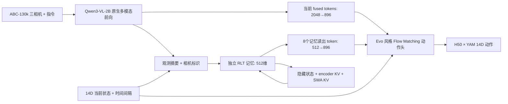

# Qwen3-VL-2B + RLT 独立记忆模块：YAM ABC-130k 详细研发方案

版本：v0.1，2026-09-17。状态：**研究方案，尚未实现或训练**。

用户已确定：视觉语言基座使用 `Qwen/Qwen3-VL-2B-Instruct`；RLT 指 Yifan Zhang 等提出的 **Recurrent Looped Transformer**；将其设计为独立记忆模块；第一数据源必须是 **YAM ABC-130k**。本方案继承 Evo-1 的连续动作学习路线，形成新的研究策略，暂名 `qwen3_rlt_yam`，不把它称为原版 Evo-1。

方案由 [03 训练与评估](../03_training_and_evaluation.md) 路由；实现边界由 [01 系统架构](../01_system_architecture.md) 与 [10 多模型接入](../10_vla_platform.md) 持有；数据语义由 [04 数据合同](../04_data_contracts.md) 持有。本文承载新实验的完整设计，不把候选参数写成已验证的项目默认值。

## 1. 要解决的问题与完成标准

目标是训练一个能用三相机、语言指令、双臂状态和历史观测预测 YAM 连续动作的策略，重点研究历史信息能否改善遮挡、动作阶段判断、双臂协作和长任务，而不是只提升静态图像问答能力。

研发分成两个可独立判断的命题：

1. 换用完整 Qwen3-VL-2B 后，在 ABC-130k 上能否学到有效的 YAM 动作策略。
2. 在同一 Qwen 策略、数据与训练预算下，RLT 的反馈和缓存能否带来可重复的额外收益。

第一版的交付物为：固定版本数据 manifest、可离线加载的模型与 processor、Qwen 无记忆策略、独立 RLT 模块、顺序训练/回放能力、可恢复训练 checkpoint、受控消融结果和 Thor 本地推理报告。真实机器人成功率需要随后在同一执行合同下测量；离线 loss 下降不能代替任务成功。

项目继续复用 LeRobot 数据接口、processor、训练循环、优化器/调度器和 checkpoint。新网络作为 LeRobot research policy 扩展，不在 `packages/vla-platform` 中引入 Torch，不另造一套训练框架。

## 2. 已核实事实、重要更正与未知项

### 2.1 Qwen 基座

2026-09-17 读取官方 Hub API 和配置，得到：

| 项目 | 事实 |
|---|---|
| 模型 | `Qwen/Qwen3-VL-2B-Instruct` |
| 固定 revision | `89644892e4d85e24eaac8bacfd4f463576704203` |
| Hub safetensors 参数数 | 2,127,532,032，约 2.128B；不是包含动作头后的总参数 |
| 文本 hidden size / 层数 | 2048 / 28 |
| 视觉 hidden size / 层数 | 1024 / 24 |
| patch / spatial merge | 16 / 2 |
| DeepStack 视觉层索引 | `[5, 11, 17]` |
| 多模态位置机制 | interleaved M-RoPE；保留原实现 |

来源：[固定配置](https://huggingface.co/Qwen/Qwen3-VL-2B-Instruct/blob/89644892e4d85e24eaac8bacfd4f463576704203/config.json)、[官方模型页](https://huggingface.co/Qwen/Qwen3-VL-2B-Instruct)、[参数 API](https://huggingface.co/api/models/Qwen/Qwen3-VL-2B-Instruct)。上述参数量来自权重索引，不代表本项目实测显存。

当前 Evo 固定代码只保留 InternVL 的前 14 层语言层，动作头宽度 896。因此新策略保留 Qwen 全部 28 层，不能沿用 `vlm_num_layers=14`；其成本也不能简单称为原 Evo 的两倍。当前 Evo 配置与代码固定在 LeRobot `2774d9bddcbbda50e697e162e89e7eaada8d7105`，后续扩展从可追溯的基点出发。

### 2.2 RLT 的真实含义和证据成熟度

用户已在本次对话确认论文身份。官方报告首发 2026-09-12、更新 2026-09-15；最新页面已加入小规模合成任务实验。其关键机制是上一时刻隐藏输出反馈、各层滑窗 KV，以及对因果编码器记忆的读取。状态会持续变化，推理时权重并不会因此自动学习或“自我进化”。

作者当前报告不构成机器人有效性或硬件加速证据；有些合成任务出现收益，也有布局/任务差异。社区 `lucidrains/RLT` 明确标为非官方实现，可审查复用，不视为即插即用的机器人记忆权重。来源：[作者仓库](https://github.com/yifanzhang-pro/recurrent-looped-tranformer)、[技术报告](https://github.com/yifanzhang-pro/recurrent-looped-tranformer/blob/cc05cfe0b24bc5eb353c6f3c14990ea4e7be0a39/Recurrent_Looped_Transformer.pdf)、[社区实现](https://github.com/lucidrains/RLT)。本次固定参考commit分别为作者 `cc05cfe0b24bc5eb353c6f3c14990ea4e7be0a39`、社区 `bb0fda4fbcd9080033321f01372ff56bd60d45c8`；后者仅定位版本，尚未做逐行实现审计。

本项目将 token 级语言建模机制改为**观测级时序记忆**，使用小网络和有界缓存，是 RLT-inspired VLA 扩展，不宣称等价复现原论文全部架构、目标函数或梯度。首轮为离线模仿学习，在线只更新运行状态；自训练、在线改权重、RL 属于后续独立课题。

### 2.3 数据规模必须区分版本

| 数据对象 | 本次查到的规模 | 用途和限制 |
|---|---|---|
| `XDOF/ABC-130k` 当前原始卡片 | 130,703 episodes，3,590.7 小时；部分有子任务标注 | MCAP 原始发布；多种相机/站点，访问条件与版本需核实 |
| `lerobot/abc_130k_v3_train` | 129,225 episodes，382,468,339 帧，201 tasks，30fps | 首选完整训练来源；三路 224×224 视频 |
| `lerobot/abc_130k_v3_val` | 1,592 episodes，5,069,390 帧，189 tasks，30fps | 官方验证来源；与 train 任务集合不完全相同 |
| 项目已验收乐高训练子集 | 4,458 episodes，10,374,181 帧，约 96.06 小时，1 task | 可用来做第一轮链路验证；不代表完整 ABC-130k |
| 项目乐高验证子集 | 69 episodes，165,142 帧 | 已有受限任务验证集；不替代全数据验证 |

训练 revision：`68651e4929d9fb00f798937b2d62617cab5c771d`。验证 revision：`46ca817c39d3df08115a75c31b3cd3867e3d875a`。

来源：[原始数据卡](https://huggingface.co/datasets/XDOF/ABC-130k)、[固定 train metadata](https://huggingface.co/datasets/lerobot/abc_130k_v3_train/blob/68651e4929d9fb00f798937b2d62617cab5c771d/meta/info.json)、[固定 val metadata](https://huggingface.co/datasets/lerobot/abc_130k_v3_val/blob/46ca817c39d3df08115a75c31b3cd3867e3d875a/meta/info.json)、[项目数据合同](../04_data_contracts.md)。原始版与 LeRobot 版的 episode 总数不同，必须按来源 ID 做映射，不能按名称认定一一对应。

当前完整 ABC-130k 在服务器是否齐备、总磁盘需求、下载进度、跨 split 重复、站点 metadata 完整性，均未在本次现场核验。完整 Qwen 权重尚未按本方案下载/转交；此前已传的 InternVL 权重保留作基线。Evo FlashAttention 的历史 GPU smoke 已通过，但不证明新 Qwen/RLT 训练调用了相同 kernel。

## 3. 总体架构与研究变量



当前视觉细节保留直接通路，历史通过单独的记忆 token 补充。这样即使记忆容量不足，动作头仍可使用当前三路完整空间特征。初期不把所有视觉 patch 串行送入 RLT，否则每帧的数百个 token 会放大时序串行开销。

第一版只同时建设两个新能力：Qwen 接入、RLT 时序模块。Qwen 保留官方 M-RoPE 和 DeepStack，不再额外替换 2D-RoPE。高分辨率、动作 delta、视觉 token 压缩、flow 蒸馏、RTC 及在线 RL 另列实验，避免归因失效。

### 3.1 模块边界

| 模块 | 输入 | 输出 | 是否跨观测保留状态 |
|---|---|---|---|
| Qwen encoder adapter | 本次三图、指令、有效 mask | `[B,L,2048]` fused features，token/camera 元信息 | v0 不保留 Qwen 跨帧 KV |
| current projection | fused features | `[B,L,896]` | 否 |
| observation summarizer | 三相机特征、尾部融合特征、当前 state、`delta_t` | `[B,512]` compact event | 否 |
| RLT memory | 当前 event、过去 memory state | 新状态和 `[B,8,512]` readout | 是，按 episode/session 隔离 |
| memory projection | memory readout | `[B,8,896]` | 否 |
| Evo action head | 当前 context、memory context、state、flow noise/time | `[B,50,24]` 内部动作 | flow 内部状态仅本次采样有效 |
| action processor | 内部动作、本模型独立 stats | `[B,50,14]` absolute YAM action | 否 |

memory state 不同于参数 checkpoint。接口需明确 `init_state`、`observe`、`readout`、`reset`、`detach_state`、`serialize_state`；运行状态可独立保存，但始终绑定模型/processor/hash。

## 4. 数据工程：先锁来源，再定义连续序列

### 4.1 数据源与准备顺序

正式主数据池选固定 revision 的 ABC-130k LeRobot train/val。用项目已验收乐高子集做预检和第一轮动作学习诊断；随后选跨任务 pilot，最终扩展到完整 train。每次子集都给出 source episode ID、source revision、任务、采样原因、长度、split 和哈希，不能把 pilot 的结果标题写成“完整 ABC-130k 训练”。

权重按用户偏好在本地优先通过 ModelScope 或可用镜像下载，再传服务器。完整数据优先复用服务器已有文件、盘点缺口；不把“模型权重本地中转”扩大成必须把数千小时数据全部重复下载到工作站。数据传输位置由盘点结果决定。

下载采用原生 BF16 safetensors，不用 GGUF/4bit 作为训练起点。镜像 repo 名相同不代表 revision 相同，需对配置、tokenizer、processor、分片列表、大小和逐文件 SHA256 核验。API 失败/下载不完整时保留临时文件与 manifest，正式目录完成后才发布。

### 4.2 键映射和动作语义

官方 LeRobot 版与项目内键存在差异，显式映射：

| 官方来源 | 项目规范键 |
|---|---|
| `observation.images.top` | `observation.images.top_rgb` |
| `observation.images.left_wrist` | `observation.images.left_rgb` |
| `observation.images.right_wrist` | `observation.images.right_rgb` |
| `observation.state` | `observation.state` |
| `action` | `action` |

每一维保持 `[左臂6关节, 左夹爪, 右臂6关节, 右夹爪]`。第一版使用来源的 absolute action，保留两个夹爪的连续值，`binarize_gripper=False`；用 Evo 原生 24D padding 和维度 mask。Pi 的 32D、delta transform 及已有 norm 不迁入。

单位依据当前 source metadata 和样本范围核验；来源文档写关节 radians、夹爪 0闭/1开，raw→port 是否逐值保持仍要独立验收。不能凭模型输出在 [-1,1] 就称物理量归一化已正确。需检查 command/state 是否有时间偏移，确定 `action[0]` 与 observation 的数据索引关系。

stats 只由本次 train split 的有效 14D 数值计算，冻结并绑定模型包。v0 沿用 Evo MIN_MAX 方案；记录异常范围而不静默裁掉数据。padding 不参与统计或 loss。多任务的原始量纲相同才能共用统计；若某站点不同，先审计分离，不能靠 task ID 掩盖合同错误。

### 4.3 图像分辨率策略

主受控实验首先使用已发布 224×224 三相机数据，Qwen 调用官方 processor，显式限制像素预算并记录实际 `image_grid_thw`。224 是 patch×merge=32 的整数倍；静态图片通常为 7×7=49 个合并后视觉 token/相机，三路约147个。此数是配置推算，验收以 processor 实际输出为准；特殊 token、指令文本另计。

相同数据放大到448不会恢复原始细节。原始高分辨率路线作为后续独立实验，保留宽高比，并核验原始 episode 与 low-res port 的 ID/时间对应；RealSense 的640×480与其他站点分辨率不能统一假设。不要从224黑边裁剪后声称恢复原图。224→448/原始分辨率是另一个实验变量，不与第一次记忆消融混合。

序列增强应跨时间保持一致的几何变换；默认禁用未经标定/标签变换的随机翻转和几何旋转。颜色增强幅度须考虑“按颜色分拣”等任务，保留可关闭配置。验证关闭随机增强。

### 4.4 划分、重复和指令泄漏

保留官方 train/val。验证集再按 episode 或可用的站点/采集组划出 `dev` 与封存的 `test`，候选比例50/50；每任务尽量保持覆盖，样本过少任务单独说明。不能把同一 episode 的窗口分别放进训练与验证。

按 source ID、文件哈希以及必要的近重复检查确认 train/val 无重复；若缺 station/operator/group 元信息，只能声称 episode-level holdout，不能声称站点泛化。201个训练任务与189个验证任务需建立名称映射和交集/差集表，不把跨repo的数字 task_index 直接对齐。仅出现在 train 的任务不伪造验证分数。

v0 指令只用部署开始时可获得的任务文本。`language_events`、事后子任务标注、成功/失败标签和未来帧不能成为当前策略输入。完整任务包含顺序说明可用；从未来人工分段得来的当前阶段真值不可偷渡进 prompt。后续子任务监督只作为训练目标且明确标注覆盖率。

### 4.5 完整性与离群审计

复用 `scripts/audit_yam_subset.py`、`scripts/convert_yam_subset.py` 和现有 manifest 工具，先核对其是否支持完整 v3 的多 episode/shard 布局；不适配时扩展公开 LeRobot 接口，不能把旧的单episode文件假设套上去。

盘点分三层：metadata/路径与哈希；全部低维数据有限性/时间索引；视频解码、首中尾及问题文件逐帧检查，逐步补足全量解码覆盖。报告各层实际覆盖数量，不把抽样通过写成全量通过。损坏原件按项目既有修复/隔离合同保留；动作尖峰先核对源数据与语义，不自动平滑、裁帧或重打标签。

### 4.6 连续窗口定义

设原始帧索引为 `f`，已审计 fps=30。初始观测/重规划频率候选5Hz，步长 `k=6` 原始帧：

```text
观测序列: f0, f0+6, f0+12, ...
每个观测输入: 三相机同一时间截面 + 当前14D state + 任务指令
每个观测目标: action[f : f+50]，仍以30Hz排列
历史只允许使用 <= f 的观测；未来action只进入监督loss
```

首个序列配置为 burn-in 16 + 学习16个观测，共32个观测点，约6.4秒采样覆盖；第一个到最后一个点间为6.2秒。反传16步约3.2秒，随后测试32/64步。H50覆盖未来50个30Hz命令，首末间49/30秒；常说“约1.67秒动作块”指50步执行时长。

序列不跨 episode、不同任务会话、时间缺口或源异常边界。有效history mask与action tail mask独立；尾部缺失标签不复制最后动作形成假真值。burn-in帧不计算动作loss，但更新所有记忆状态。

随机抽取的是完整窗口或 episode，不是把随机独立帧直接接成历史。每个batch lane拥有独立起点状态；下一batch不能按数组行号继承上一batch的记忆。

### 4.7 多任务采样

初始pilot目标约10–30小时，覆盖10–20个确实存在且数据质量合格的任务；按审计任务表选，不能事先捏造任务名单。包括当前乐高任务，以及若数据中存在的双臂配合、容器/遮挡、长序列任务。上述范围是筛选预算，实际manifest是准据。

全量阶段候选采样为任务温度采样 `p(task) ∝ sqrt(N_task)`，任务内按有效窗口抽样；与自然帧频分布对照。限制稀有任务过度重复，每次报告per-task暴露量。长episode不会只因帧多就压倒全部短任务；与此同时不能过度偏向“难例”而破坏真实分布。质量筛选规则先固定，再看模型结果。

## 5. Qwen 接入：保持预训练路径完整

### 5.1 前向路径

使用固定版本 Transformers 的原生 Qwen3-VL processor 和完整多模态 model forward。基线采用 Instruct 权重的隐藏特征，不要求先生成一段文本推理，也不采用 Thinking 模型。动作头直接读多模态 token。

输入模板固定为：任务指令 → 带名称的 top / left wrist / right wrist 图像 → 简短动作条件后缀。保存模板字节与 hash。相机名称和顺序固定，尾部 token 能访问全部相机；单个早期相机的因果语言特征未必看到了后面的相机，不能把它当全局摘要。

adapter返回：fused tokens、有效mask、各图像token位置、相机ID、实际grid、当前样本时间戳。训练调用关闭跨样本 `use_cache`，不请求 attention weights，不生成全词表 logits；取完整多模态 model 的最后隐藏状态，不绕开视觉塔/DeepStack只跑裸 text model。

HF具体调用签名在所选固定版本验证；不能把当前在线文档的接口和旧依赖混用。避免 `output_hidden_states=True` 保留所有28层激活；若版本只能如此取值，先确认开销并采用返回最后隐藏层的合法入口。

### 5.2 与 Evo 动作头衔接

当前 context用轻量 `Linear(2048,896)` 适配，保持 Evo action head 的896宽、8层、8头、H50结构作为第一基线。新projection与动作头从头训练。Qwen参数加载完整；旧InternVL动作策略不能直接视为兼容初始化。

首轮 `return_cls_only=False`，保持空间token。必须逐项验证 mask极性、padding方向、图像占位数量、RGB/像素范围、重复rescale以及三相机排序。

当前固定Evo flow block使用 `nn.MultiheadAttention`。VLM启用了FlashAttention，并不意味着动作头或RLT也使用fused attention；动作头默认返回权重可能影响快速路径。先profile，任何优化需对照前后数值和吞吐。

### 5.3 原生位置编码与RLT时间位置

Qwen内部使用原生M-RoPE/DeepStack。将多个相机当作同一时刻的多张image输入，不把相机维伪装成视频时间维。RLT自己的时间来自真实观测索引与`delta_t`，其序列位置不改写Qwen内部图像坐标。

v0每次Qwen处理当前观测，时间联系交给RLT。后续可比较Qwen短视频/多帧输入，但要保持历史长度和成本可比，不能把多帧版本的收益全归RLT。

## 6. RLT独立记忆：精确定义

以下是本项目提出的实现设计和候选参数，均不是作者已验证的机器人配方。

### 6.1 观测摘要与小型编码器

对当前Qwen的三段图像token分别做带mask的pooling，保留相机身份；再结合尾部全视角融合token、当前state的MLP特征、相机有效位和`delta_t`，生成`z_t ∈ R^512`。先采用简单、可审计的池化+投影；学习型resampler作为后续比较。

小型因果encoder对`z_1,...,z_t`建模，输出`e_t`。与Qwen分离，参数不与Qwen共享；encoder/decoder在v0也不绑权重。当前Qwen不被重复执行为所谓的“递归层”。

### 6.2 反馈与状态更新

候选转移为：

```text
r = RMSNorm(s[t-1])
g = sigmoid(Wg · concat(e[t], r) + bg)
u = e[t] + alpha · g ⊙ Ws · r
(s[t], decoder_swa_kv[t]) = decoder(
    u,
    encoder_memory_up_to_t,
    decoder_swa_kv[t-1],
    timestamp=t
)
```

decoder block顺序为局部因果self-attention → encoder-memory cross-attention → FFN，每段带残差和归一化。反馈初始`alpha=0.1`作为温和起点，可在独立实验中调节；记录state norm和gate分布，避免反馈数值持续放大。

完整运行状态至少包含：

```text
session_id, episode_id, model_hash, processor_hash
last_observation_id, last_timestamp, valid_lengths
s: recurrent final hidden state
encoder_kv: compact-event causal encoder caches
encoder_memory_kv: projected compact-event memory
decoder_swa_kv: per-layer sliding-window caches
readout_history / readout metadata（若具体实现使用）
```

原论文的跨token反馈被改为跨观测反馈。每条观测只产生一个compact event；同帧三相机先融合再写记忆，没有人为的“先看左手0.2秒后才看右手”时差。

### 6.3 初始候选尺寸与缓存上界

| 参数 | 初始候选 | 后续扫描 |
|---|---:|---|
| memory width | 512 | 256 / 512 |
| encoder / decoder depth | 2 / 2 | 2/1、2/4 |
| attention heads | 8 | 保持head_dim可被目标kernel支持 |
| FFN ratio | 4 | 固定做第一轮比较 |
| 当前观测compact event数 | 1 | 多token是独立变体 |
| decoder SWA window | 32个event，包含当前 | 16 / 64 |
| encoder上下文与memory bank | 最近256个event | 64 / 256 / 全prefix离线参考 |
| action侧memory readout | 8个token | 4 / 8 / 16 |
| 单次观测内额外循环次数 | 1 | v0不增加同帧反复循环 |

5Hz下，32个event约覆盖6.4秒窗口，256个event约51.2秒窗口；严格首末时间差分别为6.2秒与51.0秒。隐藏状态可跨更长episode传播，但能否保存有效信息必须测，不能把可持续传播等同于无限记忆。

本方案把原报告的全prefix encoder memory改成有界ring buffer，使部署内存可控。这会丢弃旧KV，是明确的算法变体。encoder本身的KV也必须有界，不能只截断decoder缓存后就声称总内存恒定。

只计2层、32长度、512宽的普通BF16 decoder KV，理论有效载荷约 `2(K/V)×2(layer)×32×512×2 bytes = 128 KiB/stream`。encoder KV、memory bank、读出、workspace和allocator另计；这个数不是整个模型显存。默认缓存有效项严格定义，若W包含当前，跨步只保留W−1个历史项。

### 6.4 读出与当前视觉通路融合

使用8个可学习query从当前`s_t`与有效compact-memory bank读出8个512维token，投影到896后追加到当前context。读出必须使用截止当前时刻的mask；候选参数预算目标为RLT+summary+readout约10–25M，具体参数量由实现自动统计。

插入模块时可以用小幅非零门控初始化控制memory token幅度，并记录门控梯度。v0不采用“完全零门控却期待所有memory参数立刻获得梯度”的设计。保留显式 `memory_mode=none|fifo|rlt|rlt_no_feedback|reset_each_observation`。

`none`是单独训练的无记忆基线。已训练RLT模型临时清空记忆属于失忆测试；如果训练时没有memory dropout，不能承诺清空后性能与无记忆基线相同。生产退路优先加载经过验证的无记忆checkpoint。

### 6.5 更新时钟与防止未来泄漏

记忆按**新的真实观测**更新，flow denoising按内部时间`tau`迭代，两者不是同一时钟。

```text
收到 observation[t]
→ Qwen前向一次
→ 从旧memory构造候选新memory一次
→ 固定context，执行N次flow求解
→ 输出H50动作
→ 成功完成后原子提交memory与response cache
```

同一观测重试、同一动作块重采样或ODE的32次迭代都不增加memory时间步。`a[t:t+50]`专家标签不写记忆；v0不输入历史预测动作或专家动作，从而先避免“训练读专家动作、部署读尚未执行的计划”的分布错位。以后若加入历史动作，必须用已执行且有时间回执的动作，另开实验。

预测到未来50步不会让当前memory预先经历50步环境变化。新图像到达后才能更新下一次状态。

### 6.6 reset、故障和并发语义

episode开始、任务会话切换、用户reset、模型/processor版本变化都清空全部状态，包括encoder、memory bank和decoder缓存。不同机器人/会话按显式ID隔离；推理服务按session串行处理状态更新。

重复observation_id返回已缓存结果或等价只读计算；乱序旧观测拒绝更新状态。候选时间缺口阈值为2秒，实际应由运行频率/控制合同确定；长缺口触发reset或预先验证的衰减策略，并记录原因。单相机缺失按数据合同报错/显式降级，不把黑图当正常观测悄悄更新记忆。

更新采用事务方式：从旧状态计算候选状态和动作，全部有限且请求完成后提交。异常保留旧状态，并标记该观测未完成；网络超时但服务器已提交时，重试ID必须返回同一结果。参数热切换使全部旧参数依赖缓存失效。

## 7. 序列训练、梯度与缓存一致性

### 7.1 LeRobot中的接入方式

新policy提供标准`forward(batch)->loss,metrics`、`predict_action_chunk`、`reset`、原生保存/加载接口。数据wrapper在现有LeRobotDataset上构造历史窗口和对应H50标签，policy内部按时间顺序执行memory。优化器更新仍由原生trainer完成。

若固定版本数据loader不能表达`[B,T,views,...]`和多时刻action targets，则在固定LeRobot研究分支中添加小范围dataset/collate工厂扩展点；这属于新policy接入，不复制整份trainer。`n_obs_steps`是否能满足需求需静态审查，不能仅把数值从1改成32就声称支持训练。

### 7.2 burn-in与TBPTT

初期每条clip从`init_state`开始，在当前权重下重放burn-in段，不对其动作计算loss；burn-in允许no_grad，以节省显存，但这是梯度截断近似。进入学习段后，对RLT hidden、encoder、decoder KV与readout保留梯度。

TBPTT边界需同时detach隐藏状态、encoder KV、encoder-memory KV和decoder SWA KV。只detach`s_t`仍可能保留跨边界计算图，造成错误的梯度范围和显存增长。就地改ring buffer不能破坏autograd；训练用可微状态表示，部署再转预分配ring buffer并做等价验证。

冻结Qwen时，在no_grad下分块计算每时刻特征；训练RLT的摘要投影仍正常反传。解冻Qwen时，对学习段按设定反传并使用gradient checkpointing；burn-in的Qwen特征同样来自当前权重，不能读取旧模型缓存冒充当前历史。

一次optimizer.step后，任何持续缓存都可能过时。v0每个batch重建clip历史，不跨optimizer更新沿用带旧参数语义的状态；在线评估固定权重时才顺序持有整episode状态。

### 7.3 短clip到长episode的分布差异

32点短clip不能证明51秒乃至更长记忆。训练课程依次扩大burn-in和学习段，候选为16+16 →32+32 →64+64；按显存/吞吐结果执行。

长记忆验证阶段加入episode起点到目标窗口的真实prefix重放；可no_grad重建前缀，但必须记录其计算成本和梯度近似。只重放最近256点仍不能恢复被旧历史影响的精确`s_t`。每轮至少单独报告cold-start窗口、有限burn-in和完整episode回放三种条件，检查对初始化的敏感性。

如冻结Qwen特征预缓存确实节省总体开销，可先对pilot做一次顺序缓存；cache key包含权重、processor、template、源帧、相机顺序及增强版本。Qwen解冻或增强改变后失效。完整数据缓存容量先测，不能缓存全数据特征后才发现磁盘不够。memory自身参数更新后仍必须重新计算其状态。

### 7.4 动作目标与loss

v0使用原生Evo Flow Matching目标及采样实现。以真实14D和有效未来时刻为mask计算loss，先确认原生reduction；改reduction时给出逐值等价/差异，不能在消融间悄悄变化。

记学习时刻集合为U，可写受控实验的目标口径：

```text
L_action = mean_over_valid_observation_targets(
    sum(valid_action_mask * squared_flow_velocity_error)
    / sum(valid_action_mask)
)
```

每个观测目标单独采样noise和flow time。sequence loss按有效目标数归一化，避免长clip天然放大梯度。mask保护内部24D中的10个padding维和episode末尾不足50步的标签。离线动作误差用固定采样种子/solver步数另外评估，flow loss不直接等于动作MAE。

第一轮只用动作loss。未来state/latent预测、阶段分类、视觉辅助loss列为可选扩展；需单独权重、可用标注比例和消融，避免低质量伪标签主导训练。不在第一版叠加多项辅助目标。

## 8. 训练阶段与初始超参数

所有步数均指**实际optimizer更新**，不是microbatch次数。表内LR和预算是可执行起点，不是已收敛配方。

| 阶段 | 数据 | 可训练部分 | 初始预算 | 通过条件 |
|---|---|---|---|---|
| P0 数据/环境/接口 | 固定少量ABC episodes | 无正式训练 | 静态检查 + 服务器GPU容量审计 | 来源、shape、mask、FA dispatch、保存重载正确 |
| P1 小集可学习性 | 32–128条完整ABC示范 + 独立val | projection、action head；Qwen冻结 | 500/1k/3k更新检查 | 对同一小集明显优于随机/持有当前状态的动作预测，梯度有限 |
| P2 Qwen无记忆基线 | 10–30h跨任务pilot | 同上，随后可阶段解冻 | 5k起，10k/20k检查 | 各任务动作/夹爪指标改善；缓存与端到端性能可用 |
| P3 独立memory训练 | 同一pilot和划分，连续clip | 先summary/RLT/readout，随后加action head | 各组5k起，10k/20k检查 | FIFO/无反馈/RLT对照、记忆敏感性和长回放均有效 |
| P4 多任务扩大 | ABC完整train的版本化数据池 | RLT/head + Qwen语言层；按门槛解冻视觉 | 先0.05等效epoch检查，再0.1/0.25/0.5/1.0 | 在验证收益、吞吐和资源预算下逐段推进 |
| P5 部署与任务验证 | 封存test、全episode回放、固定真机任务 | 权重固定 | 按评估协议 | Thor延迟、状态一致性、闭环任务结果可接受 |

P1属于调试，不能单凭训练集拟合宣布成功。P3主因果对照均从同一个P2 checkpoint开始，并给予各组相同的后续数据/动作头适配预算。先冻结action head训练memory约500–1,000更新只是稳定插入选项，各组必须采用一致可比流程；若完全接不进动作条件，检查梯度而不是盲目延长。

### 8.1 优化器候选

| 项目 | 冻结Qwen阶段 | 联合训练阶段 |
|---|---|---|
| optimizer | AdamW | AdamW，分参数组 |
| projection / action head LR | `1e-4` | `1e-5`到`3e-5` |
| RLT/summary/readout LR | `1e-4` | `3e-5` |
| Qwen语言LR | 0 | `3e-6`起，比较`1e-5` |
| Qwen视觉LR | 0 | 先0；必要时`1e-6`到`3e-6` |
| weight decay | `1e-3` | `1e-3` |
| grad clip | 1.0 | 1.0 |
| warmup | 阶段预算约3%，至少覆盖稳定审计后的早期更新 | 新阶段重新明确调度 |
| dropout | 第一对照统一0或0.1，先固定一个 | 所有对照保持一致 |
| precision | 冻结Qwen BF16；新模块FP32主参数+BF16 autocast | 可训练主参数/Adam状态FP32，前向BF16 autocast |

如果固定LeRobot实现直接把可训练Qwen参数存成BF16，必须先审计optimizer更新精度。不要因为用了autocast就推断存在FP32主参数。分阶段解冻需要检查可训练参数列表、optimizer state及checkpoint中冻结标志，避免stage2继承stage1冻结状态。

当前项目Pi的全量微调规则不会自动强制新模型初始阶段全解冻。Qwen冻结→语言解冻→必要时视觉解冻是本研究方案；LoRA不作为隐式内存应急切换，若要比较应独立命名。

### 8.2 batch、更新计数和公平预算

候选4×4090，sequence每卡microbatch=1，gradient accumulation=4，得到每次更新16条clip。若每clip有16个监督观测，则有效目标为256个/更新，但这些时间点相关，不能当256条独立示范；burn-in也会消耗Qwen前向时间。

Qwen单帧基线和RLT序列模型同时记录：

```text
optimizer_updates / microsteps / gradient_accumulation
clips_seen / supervised_observations / unique_episodes / unique_frames
burnin_observations / qwen_forward_observations
visual_tokens_processed / GPU_hours / wall_hours
per_task_exposure / source_dataset_equivalent_coverage
```

同优化器更新数不自动构成公平比较。主消融固定相同监督观测与初始化，另给等GPU小时比较；固定相同三相机、分辨率、动作头、H50和flow采样数。Evo与Qwen对照另外报告参数数与计算成本，因为基座尺寸及预训练不同。

现有固定LeRobot trainer曾发现step/scheduler与microstep计数相关的问题；落地时核对`sync_gradients`和实际optimizer.step，scheduler/checkpoint/log均以真实更新计数记录。DDP/FSDP是否把batch解释为每卡需用运行日志证实。

## 9. 四卡资源、FlashAttention与成本核算

### 9.1 显存边界

Qwen官方权重约2.128B，BF16权重载荷约4.26GB（十进制）或3.96GiB。若FP32参数、FP32梯度和两个FP32 Adam状态全部复制，每参数约16 bytes，Qwen本体约34.04GB，已超过单卡4090的24GB，且还未计激活、动作头、memory及临时buffer。

因此冻结基座阶段先用DDP；完整可训练阶段评估原生Accelerate/FSDP或ZeRO分片，不能承诺普通DDP可全量训练。优先保持数据/模型语义，通过分片、gradient checkpointing、microbatch和累积解决；每卡batch1仍OOM时，明确调整预算或架构实验。4卡无NVLink时通信代价必须实测。

不以Pi单步耗时、FlashAttention微基准倍率或2B名称估计完整训练速度。动作头896宽/H50的投影也有参数开销，总参数/优化器state要从实际网络统计。

### 9.2 新环境

使用独立Qwen/RLT Conda prefix候选 `/home/wuyan/.conda/envs/vla-qwen3-rlt-train`，服务器 `module load miniconda3/26.1.1`；通过项目镜像和wheel锁准备环境。具体Python、Torch、CUDA runtime、Transformers、FlashAttention、LeRobot研究revision在兼容审计后锁定，不直接把`latest`写进正式配方。

既有Evo环境中FlashAttention2.8.3曾在4090完成kernel/dispatch smoke，是复用线索。新环境仍需检查Python ABI、Torch CXX11 ABI、GPU架构、CUDA runtime、forward/backward以及真实模型dispatch。不能以`import flash_attn`成功替代端到端证据。

### 9.3 GPU审计矩阵

在获准的服务器计算节点、独立Slurm作业中依次验收：

1. Qwen三相机224前向与实际输入token统计；变长batch、padding、单样本与batch数值对照。
2. 冻结Qwen动作头完整forward/backward；首次Adam状态分配、显存峰值、梯度有限。
3. RLT完整32点clip、burn-in/TBPTT、一次反向；full BPTT短段对照仅在服务器执行。
4. 联合训练和分片的完整前反向、optimizer step、保存/重载，包含AMP与可训练参数精度。
5. 至少100–200个稳定microstep的吞吐窗口，分离解码、processor、Qwen、memory、flow、backward、同步和保存时间。
6. profiler证明Qwen vision/text各自attention后端，记录RLT小窗口和action head实际kernel；允许经过验收的高效SDPA作为实现选择，禁止静默eager后把变慢归于模型架构。

本地工作站仅做配置、静态代码和轻量协议测试，不执行训练循环，包括CPU/debug小模型训练。长作业不在登录节点执行；现有Pi训练/下载先查实时状态，按资源时段排队，不自动停止它们。

### 9.4 从实测推算总成本

完整train共有382,468,339行，约3541.37小时（由帧数/30计算）。5Hz索引忽略episode尾部时约63.745M个候选观测起点；正式N由manifest逐episode计算。一个H50目标与相邻目标重叠，不乘50当独立数据覆盖。

若每更新16条clip×16监督点=256目标，粗略一遍候选起点约249,003更新；这是采样暴露量估算，窗口重叠和任务重采样使其不等于唯一数据覆盖。假设测得每更新10秒，则一遍约691.7墙钟小时、四卡约2766.8 GPU小时；这是示例计算，**不是性能预测**。

正式预算使用 `预计墙钟小时 = 目标更新数 × 实测秒/更新 ÷3600`，再单列数据准备、burn-in重放、评估、保存与恢复成本。0.05等效epoch约12.45k更新只作为首个全量检查点，不能预设0.05就足够。先产出吞吐报告再决定总预算，避免在几千小时数据上盲开80k/100k。

## 10. 消融矩阵与可证伪假设

| ID | 基座 | 历史模块 | 研究问题 |
|---|---|---|---|
| E0 | 原固定InternVL/Evo | 无 | 工程/成本参考；不是同参数预算对照 |
| Q0 | Qwen3-VL-2B | 无 | 更换VLM后的动作基线 |
| Q1 | 同Q0 | FIFO compact-history + 相同readout | 普通历史是否已经足够 |
| Q2 | 同Q0 | 与RLT同计算图，`alpha=0`反馈关闭 | 反馈本身是否带来收益 |
| Q3 | 同Q0 | 完整RLT观测级记忆 | 主候选 |
| Q4 | 同Q0 | 参数预算相近的GRU或普通temporal Transformer | 是否必须使用RLT机制 |
| Q3-reset | 同Q3 checkpoint | 每观测清空完整state | 推理失忆敏感性，非独立训练基线 |
| Q3-short/long | 同Q3设计 | 改history/burn-in/cache长度 | 长历史收益和成本 |

Q2保留merge/投影的存储参数而将feedback scale固定为0，避免只比较不同参数总数；那些参数有效梯度为0需如实统计。作者页面的“w/o feedback”可以有不同删模块定义，本表是本项目控制实验。Q1/Q2/Q3尽量使用相同8个memory读出、同宽action head和同clip目标。

先单seed筛查实现和大方向，再对Q0/Q1/Q2/Q3中关键组至少3个seed复验。所有Q组从同一个无记忆机器人基线checkpoint分叉；随机新模块固定初始化seed。不要让Q3额外训练更多数据后只与未继续训练的Q0比较。

预注册假设：

- H1：Q3在历史依赖评估中优于Q0；若只在当前清晰画面变好，历史价值尚未证明。
- H2：Q3优于Q1/Q2；若FIFO或无反馈同样好，证据支持历史输入/缓存，不支持反馈机制独有收益。
- H3：收益在匹配GPU小时后仍有意义；若吞吐显著降低，需要报告成功率—成本曲线。
- H4：RLT在完整episode回放稳定，效果不只来自短clip冷启动协议。

## 11. 评估协议与阶段门槛

### 11.1 离线动作指标

每任务及宏平均报告：12个关节分组MAE/RMSE、左右夹爪连续误差、首6步与完整H50误差、动作差分/jerk诊断、预测的有效范围、非有限比例。单位未独立验实前写“数据合同单位”，不换算毫米末端误差。FK误差需要正确机械臂参数、标定和单位后另算。

夹爪开闭事件阈值来自训练统计并预注册，分别报告左右臂事件精确率/召回率和时间偏差；主模型仍输出连续值。flow loss使用固定验证noise/time种子估计，多次采样动作误差另报，避免随机性掩盖小差异。

除任务macro外报告频率加权micro。不要让一个高频任务掩盖长尾退化。置信区间按episode或采集组bootstrap，不能按高度相关的连续帧当独立样本。

### 11.2 记忆专项验证

在封存评估计划中定义：短时遮挡/缺帧压力测试、同类画面不同历史阶段、重复抓取/放置、双臂交接（如果数据确有此任务）、10/30/60秒历史长度。先从ABC真实任务中标注小型审阅集，遮挡合成只是压力测试，不能冒充真实遮挡任务成功率。

对同一Q3权重做以下干预：完整历史、清空历史、截短历史、相同任务内错配过去历史。错配仅用于离线诊断且保留当前图像/state，不用于控制机器人。比较输出及指标变化，检查memory gate/状态范数/历史利用是否退化为常量。注意力可视化只是辅助，不能单独证明记忆有效。

测试重复观测不重复更新、单步streaming与整段causal forward一致、snapshot/restore后等价、episode边界无泄漏、未来帧替换不影响过去输出。权重固定、dropout关闭、相同噪声和相同position约定下先做FP32再做BF16容差测试。

### 11.3 候选进入下一阶段的门槛

| Gate | 必须具备的证据 |
|---|---|
| G0 数据就绪 | 固定源revision；manifest、split、键/维度/时间合同；单位与未知项记录；有效文件覆盖审计 |
| G1 Qwen策略可训练 | 真实三相机batch前反向有限；有效动作维mask；保存重载；实际attention dispatch；资源报告 |
| G2 memory正确 | 因果性、全state reset、streaming等价、clip/episode隔离、反传范围；状态内存不随长episode无界增长 |
| G3 memory值得扩大 | 3seed关键对照；历史依赖任务有一致收益；普通任务不明显退化；成本与FIFO/无反馈比较 |
| G4 Thor可运行 | 完整Qwen+memory+flow非量化参考可用；state复位/重试一致；P50/P95、内存和持续运行证据 |
| G5 任务有效 | 固定控制版本、物体/布局、模型包和延迟设置下的机器人闭环测试 |

G3候选量化门槛：历史专项episode聚合误差相对Q0下降≥5%，关键普通任务宏平均不恶化超过2%；最终任务评估候选要求成功率提升≥5个百分点，且给出差值置信区间。这些是项目初始决策阈值，不是论文结果；正式评估前按业务目标和基线方差冻结。若区间包含0或样本不足，结论为证据不足，不能硬写成功。

### 11.4 真实任务测量

先每组每任务10–20次做流程排错，再对主比较做至少50次、覆盖多个布局/物体和至少2个时段；根据置信区间精度继续增加。50次只是起点，不保证能区分5个百分点差异。

分别记录抓稳抬升、正确放置、完整任务、完成时间、人工介入、失败类型与推理延迟。部署的action执行合同固定；Q0/Q3使用同一物体尺度、控制软件版本与命令融合策略。现有16mm物体与ABC差异单独报告，ABC-only模型的现场失败不能直接归因于RLT。

本仓库只负责模型/Thor侧。真机测试由既有YAM控制系统及负责人员执行；本任务不读取、修改或部署3588控制与采集代码。需要新增reset/timestamp字段时，先给出接口规范和Thor侧测试，再协调控制侧，不能宣称跨IPC闭环已经完成。

## 12. Thor部署与实时约束

训练H50与实际一次执行步数分开。5Hz重规划候选对应每次执行6个30Hz命令；并不默认盲执行完整50步。第一参考路径保留Evo默认32个flow采样步，随后10/16/32分别做质量—延迟比较，不能未经验证直接降步数。

在Thor模型系列独立Docker环境先跑PyTorch BF16/FP32参考，分解三相机解码/预处理、Qwen前向、RLT更新、flow求解和服务开销。CUDA event须同步计时，预热与正式测量分开。推理测试按项目既有MAXN规则并记录温度/降频，结束恢复日常模式。

目标5Hz意味着单次预算200ms。初始设计目标为端到端P95≤200ms，memory额外P95≤10ms；均为目标，尚无实测保证。若达不到，报告并选择有实测依据的低频策略或后续优化；训练中对应改变观测步距和`delta_t`分布。不能拿旧Pi TensorRT约100ms推断新Qwen/RLT速度。

state service接口至少包含：model_hash、session/episode ID、observation_id、capture timestamp、三相机、14D state、instruction、reset标记；响应含H50动作、动作时间步、服务计时、已提交memory序号和状态。服务端即便只做本地回放，也按此合同校验。

新模块先验非量化精度；TensorRT/ONNX动态cache导出、固定shape桶、CUDA Graph和量化是后续步骤，需分别比较原生动作与完整memory state。动态控制流/状态读写可能是导出难点，不承诺一次转换成功。不把Pi转换器或旧引擎套在新模型上。

## 13. 工程落点和版本管理

### 13.1 计划中的代码职责

以下是拟新增/修改项，不是当前已存在的执行入口：

| 位置 | 责任 |
|---|---|
| 固定LeRobot研究分支 `policies/qwen3_rlt/` | configuration、原生Qwen adapter、memory、modeling、processor注册 |
| 同一LeRobot分支的dataset扩展点 | episode窗口、burn-in/学习mask、序列collate；复用原始视频与数值读取 |
| `adapters/lerobot/` | 复用共享launcher和metrics；仅必要的policy注册/数据工厂接线 |
| `configs/models/qwen3-rlt.toml` | 模型ID、backend、planned capability与合同引用 |
| `configs/experiments/` | Q0/Q1/Q2/Q3配置、pilot/full数据manifest引用 |
| `configs/environments/` 与现有环境锁路径 | 独立Conda、固定依赖、下载镜像与版本来源 |
| `scripts/` | 复用/扩展数据盘点与audit、memory回放验收入口 |
| `scripts/thor/` | 后续新策略模型服务adapter与本地stateful smoke |
| `docs/reports/training/` | 版本化预检、容量、训练与消融报告 |

本仓库只维护薄接入和固定upstream研究revision引用；新网络在可追溯LeRobot扩展中。服务器代码仍从已配置Gitea获取，本地GitHub作备份；外部源码需在本地取得并经现有来源通道交接。首轮不会为每个memory ablation复制训练循环。

当前共享launcher拒绝普通`resume`，续训必须走已核实的原生workflow并保存对应参数；不能用warm-start冒充完整resume。模型能力只有通过G1/G4后才分别开放`train`/`infer`。

### 13.2 checkpoint与运行证据

正式checkpoint必须包含：模型参数、Qwen/新模块config、processor和独立norm、optimizer、scheduler、随机数状态、AMP状态（如使用）、真实更新数、数据采样器位置/seed、数据manifest hash、环境锁、代码commit和训练阶段。

阶段切换允许从权重warm-start并重新建optimizer，但须新run记录；同阶段resume应恢复完整状态。每个关键阶段实测“保存→新进程加载→下一批等价/容差与损失连续性”。仅权重加载成功不等于可恢复训练。

训练中memory状态一般随clip重建；如果未来采用跨batch持久流训练，还需保存每个lane的episode/cursor和全部state，并证明恢复精度。不能只存`s_t`漏掉KV。部署state snapshot绑定权重hash且不混入可移植权重包。

指标接入现有[模型无关看板](../11_training_dashboard.md)，补充memory state norm、gate均值/饱和率、cache长度、reset次数、history长度、flow loss、动作误差、有效目标数、吞吐、显存和分阶段延迟。图表的step轴明确是optimizer更新。

## 14. 开始执行的工作包

### WP0：固定身份、版本与可用资源

输入：本方案、用户确认的RLT、当前源库和服务器清单。

产物：`experiment_spec`、Qwen/LeRobot/RLT参考revision与hash、ABC train/val manifest草案、资源/磁盘缺口表、现有任务保护清单。首次确认完整ABC本地覆盖及镜像可用性，明确本次pilot名单。

验收：每个已知事实有来源，未知项有检查入口；代码与模型版本可复取。预估0.5–1工程日，不含网络等待。

### WP1：Qwen本地下载、服务器交接和环境审计

按ModelScope/镜像→本地逐文件校验→可续传传输→服务器复核→离线加载的顺序操作。只下载所选Qwen训练权重与processor，RLT模块随机初始化，不存在已验收的机器人memory权重需要下载。

产物：模型文件manifest、服务器路径、Conda锁、真实GPU加载/attention报告。预估1–2工程日，下载和编译另计。

### WP2：Qwen + Evo动作头无记忆基线

实现原生Qwen adapter与2048→896投影、ABC键映射、真实14D处理和三相机配置。先通过G1，再在32–128条ABC完整示范上检查可学习性。新模型的总参数、各组可训练参数和每步耗时一并统计。

产物：Q0 policy、保存重载样例、首份动作预测/误差报告。预估2–4工程日；训练时间以WP1实测修订。

### WP3：序列数据与独立RLT

实现causal compact encoder、feedback/SWA/memory bank、8-token readout、完整state生命周期、顺序clip与TBPTT。先验证全state reset、streaming等价、未来不泄漏和参数更新后重放，再接训练。

产物：Q1/Q2/Q3统一配置接口、state验收报告、序列容量和吞吐报告。预估3–5工程日；社区源码通过审查可减少工作，但不预先把它计为可直接使用。

### WP4：pilot受控实验

运行Q0/Q1/Q2/Q3的低预算筛查和关键3seed复验；按真实样本暴露量与GPU小时比较。明确失败类型：数据/动作合同、当前视觉不足、memory无梯度、顺序错误、短clip泛化差、成本过高。

产物：可重复实验矩阵、初始G3结论、下一阶段预算。没有超过FIFO/无反馈时，保留负结果并调整研究问题，不直接扩大数据掩盖问题。

### WP5：完整ABC-130k扩大与联合训练

先补齐完整数据盘点/审计，冻结train-only stats。由pilot吞吐估算0.05/0.1等效epoch，依验证曲线逐步扩展；完整train多任务采样、分片训练、resume每项留证。

产物：完整ABC来源的Qwen+RLT候选checkpoint、任务覆盖/暴露报告、长episode评估。下载、解码和GPU成本单独核算，不承诺固定几天训练完成。

### WP6：Thor参考部署与任务评估

先G4，再协调既有控制系统的G5评估。state协议、推理截止时间、重复请求行为和新会话reset随模型交接；参数量小不替代延迟测量。

产物：Thor原生参考服务、状态一致性报告、非量化延迟、固定任务闭环结果。实时目标失败则先定位瓶颈，再决定flow降步数、压缩或蒸馏实验。

## 15. 首轮实验配置草案

此YAML仅是设计规格，**尚不是当前launcher可直接执行的配置**；落地时生成原生policy配置，并由schema拒绝缺失的manifest/path。

```yaml
experiment: qwen3_rlt_yam_abc130k_v0
status: planned
backbone:
  model_id: Qwen/Qwen3-VL-2B-Instruct
  revision: 89644892e4d85e24eaac8bacfd4f463576704203
  language_layers: 28
  use_native_processor: true
  cross_frame_kv_cache: false
  feature_dim: 2048
  action_context_dim: 896
data:
  train_id: lerobot/abc_130k_v3_train
  train_revision: 68651e4929d9fb00f798937b2d62617cab5c771d
  val_id: lerobot/abc_130k_v3_val
  val_revision: 46ca817c39d3df08115a75c31b3cd3867e3d875a
  manifest: REQUIRED_AFTER_AUDIT
  split_by: episode_or_capture_group
  source_fps: 30
  observation_stride: 6
  views: [top_rgb, left_rgb, right_rgb]
  image_source_size: [224, 224]
  expected_visual_tokens_per_view: 49  # assert实际processor输出
  action_representation: absolute
  real_state_dim: 14
  real_action_dim: 14
  padded_state_dim: 24
  padded_action_dim: 24
  action_horizon: 50
  binarize_gripper: false
  norm: REQUIRED_TRAIN_ONLY_STATS
sequence:
  burnin_observations: 16
  supervised_observations: 16
  cross_optimizer_state_reuse: false
  future_observations_as_input: false
memory:
  mode: rlt
  dim: 512
  encoder_layers: 2
  decoder_layers: 2
  heads: 8
  feedback_scale_init: 0.1
  decoder_window_including_current: 32
  encoder_window: 256
  memory_bank_max_events: 256
  readout_tokens: 8
  updates_per_unique_observation: 1
  recurrent_iterations_within_observation: 1
  online_weight_updates: false
action:
  head: evo_flowmatching
  width: 896
  layers: 8
  heads: 8
  reference_solver_steps: 32
  execution_steps_candidate: 6
training:
  stage: frozen_backbone_pilot
  optimizer: adamw
  trainable_master_dtype: float32
  autocast_dtype: bfloat16
  devices_candidate: 4
  per_device_microbatch_clips: 1
  gradient_accumulation: 4
  optimizer_update_budget_initial: 5000
  count_steps_as: actual_optimizer_updates
  resume_validation_required: true
```

## 16. 决策记录与本轮交付范围

2026-09-17用户选择Qwen3-VL-2B、确认RLT论文身份，并指定ABC-130k优先。本轮完成原始资料、固定源码/数据配置核对和详细设计；新增研究文档、训练/接入路由与历史记录。未实现新policy、未启动下载/训练、未操作Thor或3588。

执行起点明确为WP0/WP1，首个可判断的模型结果是WP2无记忆Qwen策略。RLT与序列数据可以并行实现，但正式扩大全量训练前必须取得无记忆、FIFO、反馈关闭及完整RLT的可比证据。

## 17. 来源与复核入口

访问时间均为2026-09-17；网络页面可能继续更新，正式执行前复核固定代码commit并记录下载文件hash。本次配置文本SHA256：Qwen config `bec4b3d446efa05807365c9e1cec03ac590836879d02f3a6da879971154bdd3b`；ABC train info `6c28ba76ecd04adcd3f198208c3a588ef18ab46f4f30f31897d7d90d4243914b`。这只核验了配置文本，不代表模型/数据文件已下载并验收。

1. [Qwen固定配置](https://huggingface.co/Qwen/Qwen3-VL-2B-Instruct/blob/89644892e4d85e24eaac8bacfd4f463576704203/config.json)；[模型卡](https://huggingface.co/Qwen/Qwen3-VL-2B-Instruct)；[HF原生实现说明](https://huggingface.co/docs/transformers/model_doc/qwen3_vl)。配置事实与本项目动作收益分开。
2. [RLT作者固定版本](https://github.com/yifanzhang-pro/recurrent-looped-tranformer/tree/cc05cfe0b24bc5eb353c6f3c14990ea4e7be0a39)；[2026-09-15修订报告](https://github.com/yifanzhang-pro/recurrent-looped-tranformer/blob/cc05cfe0b24bc5eb353c6f3c14990ea4e7be0a39/Recurrent_Looped_Transformer.pdf)。以当前修订为准，不沿用搜索缓存中“完全没有实验”的旧描述。
3. [RLT社区固定版本](https://github.com/lucidrains/RLT/tree/bb0fda4fbcd9080033321f01372ff56bd60d45c8)。非官方，需逐项核对因果mask、cache、detach、依赖和许可证；不直接运行其语言训练脚本代替本项目训练。
4. [ABC原始数据卡](https://huggingface.co/datasets/XDOF/ABC-130k)；[train固定metadata](https://huggingface.co/datasets/lerobot/abc_130k_v3_train/blob/68651e4929d9fb00f798937b2d62617cab5c771d/meta/info.json)；[val固定metadata](https://huggingface.co/datasets/lerobot/abc_130k_v3_val/blob/46ca817c39d3df08115a75c31b3cd3867e3d875a/meta/info.json)。不同发布版不可混计。
5. [Evo固定配置](https://github.com/huggingface/lerobot/blob/2774d9bddcbbda50e697e162e89e7eaada8d7105/src/lerobot/policies/evo1/configuration_evo1.py)；[动作头](https://github.com/huggingface/lerobot/blob/2774d9bddcbbda50e697e162e89e7eaada8d7105/src/lerobot/policies/evo1/flow_matching.py)；[当前embedder](https://github.com/huggingface/lerobot/blob/2774d9bddcbbda50e697e162e89e7eaada8d7105/src/lerobot/policies/evo1/internvl3_embedder.py)。不能仅修改模型名兼容Qwen。
6. 项目[数据合同](../04_data_contracts.md)、[Evo接入](../10_vla_platform.md)、[FlashAttention实测](../reports/environments/evo1-flash-attn-20260916/README.md)、[已有权重交接](../reports/environments/evo1-model-transfer-20260916/README.md)。历史通过有明确适用环境，新策略仍需验收。
