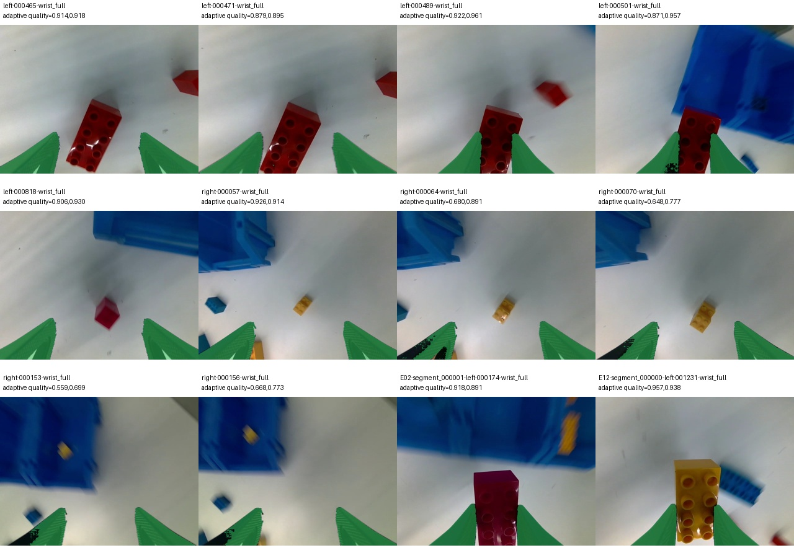

# 14 集逐次抓取候选审核集 · 2026-10-10

用户要求保留成功、失败与不确定候选，生成后先人工检查，**不开始 RL 训练**。本轮只做数据提取、Thor 离线 SAM3 推理和审核页面；没有训练更新、生产推理接入或 3588 操作。当前 PARTS 算法仍为论文的夹爪残差 TD3+BC 路线，LWD/DIVL 讨论没有改变这一分工。

## 数据与审核入口

本地派生目录：`/home/wuyan-lyj/condapi-data/rl/lego-grasp-review14-20261010-v1/`，打开 `index.html`。源目录为既有只读 `lego-rollout14-20261010-parts-v1/`；14 集顺序、20w 用户声明及前两集资产来源冲突仍沿用[原审核](../parts-rollout14-20261010/README.md)。未将整轮 121/140 正确分拣直接转换成逐抓取奖励。

共 **273 个闭爪候选**：左臂108、右臂165；**3,846 张唯一腕部图像**，另有273段顶视/左右腕同步视频。第一集的10个候选为 `validation`，其余263个为 `train_candidate`；这表示后续用途，不是训练就绪。重复尝试、可能的非抓取调整、观测中断与片尾候选都保留；闭爪启发式不能保证找全所有实际抓取。

审核文件：

- `candidates.json`：完整行、epoch/tick、时间、原视频引用、几何证据、自动建议、原因。
- `review.csv`：可填写的中文友好 UTF-8 BOM 表；`review_label` 初始为空。
- `index.html`：离线筛选、播放、原图/叠图切换、人工成功/失败/不确定/非抓取、备注、JSON导入导出；不把自动建议当成人工审核。
- `vision/`：逐图 boxes/scores 与压缩 bit masks，保留模型与脚本身份；`image-jobs.json` 记录源视频 PTS/time_base 和派生图 SHA。
- `clip-manifest.json`、`clip-audit.json`：源时间窗、视频 SHA、完整解码及时间轴检查。

自动建议为 **成功2、失败0、不确定271**；成功项也未经人工确认。逐集结果见[summary.json](summary.json)。**自动审核未通过，不能直接生成RL奖励。** 全部 `approved_reward=null`，人工已审核数为0，`ready_for_training=false`；没有把不确定样本改成负例，也没有从审核按钮自动发布训练奖励。

## 可解释的候选规则与限制

测量夹爪开度使用开/闭迟滞找候选；遇到 tick/epoch 或时间断裂即切断。每0.20秒及进入/闭爪/结束关键行取腕部图像；视频按记录的 `video_indices` 对齐，不能把控制行号当视频帧号。相机时间来自 `camera_host_received_at`，不是已经验证的硬件曝光时间；本批该字段没有非有限值。

最终相对高度使用**候选进入行**的各臂 base-Z，不使用未来最低点。初始提取曾保存闭爪附近最低点；原 `candidates-unscored.json` 与提取脚本快照保留，最终文件中的 `earlier_provisional_reference` 只作溯源，不参与最终建议。进入点只是闭爪启发式的进入行，仍需验证是否对应正式 selector；向上轴尚未标定。所有高度结果均为候选证据。

SAM3 使用 `LEGO brick`、`plastic storage bin`、`robot gripper fingers` 三个文本提示。结合指间图像区域、容器排除、分割面积/位置连续性、夹爪状态、新鲜且不同的帧，建议成功需相对进入行抬升≥5cm、连续持物≥1秒。零检测、模糊、遮挡或快速放置均不足以判失败。空手负例还要求明确的夹爪正检和连续空隙证据；当前提示词在这些 YAM 夹爪图像上识别不足，不能为了得到负例降低门槛。失败尝试会因此留在不确定项中等待审核。

这些规则不是已验证的奖励模型，没有人工 precision/recall 或在线验收；遮挡、白色积木、容器边缘及桌上积木可能误检。人工审核还需检查候选边界与参考点，不能只核对叠图是否分割到了积木。审核结果不能补出尚未执行过的专家残差。

## 推理与验证

Thor 环境和官方同 SHA 镜像权重沿用[视觉环境报告](../../thor/parts-vision-20261010/README.md)。本轮独立容器 `parts-grasp-labels-20261010`，网络关闭、无端口或控制设备映射；batch4、FP32 参数、上游 BF16 autocast。使用固定 SAM3 源码的原生 batch grounding，3张图与单图高置信 box 对照最大差0.1161像素；不称逐像素等价。正式结果见[vision-run.json](vision-run.json)，原始日志和退出状态保留在 Thor 与外部派生目录。

273段视频全部完整解码，PTS严格递增，与源首末时间差的最大误差 **0.000500秒以内**。首版编码器按10Hz量化不规则时间导致写入失败；失败派生片段保留在兄弟目录 `lego-grasp-review14-20261010-v1-failed-clips-v0/`。修正编码 time_base 为1ms并重新导出，未改原录像。

纯数组/监督测试 **29 passed**；限定 Ruff、Python AST、页面 JavaScript 语法与 `git diff --check` 检查。独立 QA 数据集验证了视频解码、标签与备注刷新恢复、未审核筛选、JSON导出与导入恢复；QA身份与本批审核集不同，没有代填用户标签。本地未导入 Torch、执行模型前向或训练循环。真实 SAM3 前向仅在 Thor 执行。

入口为 `scripts/parts_rl/prepare_review.py`、`predict_review.py`、`render_clips.py`、`build_review.py`；后处理纯数组规则归 `packages/parts-rl/src/parts_rl/candidates.py`。大文件保留在外部数据目录，不加入 Git。

## 用户反馈后的判定试验

第一版只用左右腕部，夹爪仅一条 `robot gripper fingers` 提示；主视角只用于回放。这是不充分的提示词/视角探索，不能据此判断相机看不到夹爪。按用户建议，另选12张腕部原图、对应12张下半裁剪图和2张同步顶视图，测试13个提示，包含 `black triangular gripper fingers`、`black ribbed triangular fingers`、`black triangular plastic wedges`、`black wedge-shaped jaws` 等外观描述。原提示在本试验仍0检出（max score≥0.5）；纹路三角夹指提示原图2/12、裁剪2/12，只是覆盖率而非准确率。积木改用 `plastic building block` 在原图11/12有检测，仍需排除容器和桌面误检。另做SAM3框视觉示例与实例点提示，不能把任何高分mask视作正确夹指；原始输出、叠图和独立摘要保留。

试验目录为 `/home/wuyan-lyj/condapi-data/rl/lego-grasp-prompt-probe-20261010-v1/`，Thor同名目录。脚本为 `probe_prompts.py`、`probe_visual_boxes.py`、`probe_points.py`，只推理不训练，不能据小样本宣布自动奖励已验收。论文[附录D](https://arxiv.org/html/2609.21788v2#A4)明确省略标定、辅助函数等实现细节；其视觉使用SAM3，但未公开本地可直接复用的完整检测配置。本文独立实现不冒称作者未公开的trick。

有效改进是**SAM3实例点提示，不是新文字词**：固定点在闭爪后会落到桌面，造成表面上“夹住反而分不出”。改为每半幅底部暗色长连段自动选择夹指正点，另一夹指和中上区域作负点，启用同一权重的 `enable_inst_interactivity=True` / `predict_inst`。12张样图的左右输出均主要落在黑色夹指（各mask暗色比例≥0.65），叠图定性检查明显改善；部分模糊图仍缺失指面细节，**这不是12/12抓取判定准确率**。固定点、框示例和自适应点均保存独立结果；最后一次自适应点批次退出0、无OOM，未修改初版273个建议或批准奖励。执行脚本SHA见[摘要](prompt-probe-point-adaptive-summary.json)，外观/面积检查见[诊断](prompt-probe-point-adaptive-audit.json)。

用户观察“夹住后分割消失”可作为待检验的时序特征，不能直接作成功reward。需要区分积木遮挡、运动模糊、出画、掉落与提示点落空；抓取前目标身份、闭爪后遮挡、抬升时随动/重现共同支持持物。单帧未检出保持unknown，不因漏检自动奖1或罚0；尚未实现或验收遮挡跟踪器。

用户反馈1秒过长，先比较5cm相对抬升加短时新鲜持物证据，不改正式监督器默认。纯物理抬升且闭爪窗口≥0.2秒有197个，≥1秒113个；沿用v1稀疏视觉规则对应54和2个，仅诊断，不重标成功。v1每0.2秒抽帧，不能假装已验证0.2秒内3–5张新图。之后的光流原型在8段212帧试验中全部保持不确定，未形成有效自动奖励；最新用户要求撤下自动跟踪，转用下节尖端ROI试验。旧光流代码及输出只留在外部 `lego-motion-probe-20261010-v1/run-scripts/retired/` 等证据目录，未提交进本轮工作树，不删除远端环境或实验原件。窗口摘要见 `window-diagnostics-summary.json`。

原始文件后缀只有H5/JSON/MP4，未保存深度流。SAM3分割可以与真实对齐深度结合，但本批不能追补传感器深度。[Depth Anything V2](https://github.com/DepthAnything/Depth-Anything-V2)的通用权重输出相对深度；可用作辅助线索，不能直接把预测当5cm测量或唯一空手判据。本轮尚未下载或运行深度模型，未向客户端发送采集改造要求。

## 夹指尖端连接区域：20例固定80%门槛，无跟踪

用户授权测试“两片夹指尖端之间的小连接区域，彩色占比大于80%”，并明确去掉自动跟踪。新派生目录为 `/home/wuyan-lyj/condapi-data/rl/lego-fingertip-roi20-20261010-v1/`；独立审核入口 `http://127.0.0.1:8758/index.html`。原v1审核集及ZIP不改。页面包含20例原图、SAM3指面、自动尖端/窄带叠图、两种占比、逐例目视备注及三视角回放；初次结果与后续探索性对照分别留档。

在计算占比前选定20个不同候选：E01第一左/右候选、已有两个持物建议E02-L004/E12-L005、E04左右各前5个可抬升候选、E03/E07/E10左右各首个可抬升候选；具体ID和规则见[fingertip-roi20-selection.json](fingertip-roi20-selection.json)。每个候选在闭爪行后、开度<0.60、进入行相对抬升≥0.05m的已有采样中选最大抬升帧。实际相对抬升6.9–17.9cm；这个参考不是绝对离桌高度，向上轴仍未独立标定。此为定向诊断集，不是随机评估集或独立holdout。

**几何与规则：** 复用有效的SAM3自适应实例点提示，每图独立推理两片夹指，不跨帧跟踪。选包含暗色正提示点的连通分量，用mask像素纵坐标1%分位和其后5行的横坐标中位数估计上端尖点；以两个点连线为轴画总宽12px窄带，扣除指面后作为分母。间距<8px、有效区域<48px、有效区域不到窄带一半、mask quality<0.5或指面暗色比例<0.6时为unknown；质量分数不作为成功概率。20例均通过几何检查，叠图尖端定性核对合理。

固定判据是 `彩色像素数/有效区域像素数 > 0.80`，不是≥。首轮保守色彩定义为 `maxRGB>=60`、`chroma>=45`、`chroma/maxRGB>=0.25`；观察到阴影漏判后，另记探索性宽松对照 `maxRGB>=30`、`chroma>=12`、`chroma/maxRGB>=0.20`。两者都不改80%门槛；后者根据本批结果提出，不能冒充独立验证。脚本为 `scripts/parts_rl/analyze_fingertip_roi.py`，快照及SHA留档。

助手检查20张原图、几何叠图及所选时刻前后约0.2秒静态视频帧，记录**当时持物13、当时指间为空7**。这是快照持物状态的定性审核，不等于逐attempt成功/失败：例如E01-R001所选时刻可能已放置，E04-R003更早有红色积木经过指间。未代填用户的273条审核结果。逐例依据见[fingertip-roi20-snapshot-audit.json](fingertip-roi20-snapshot-audit.json)，完整测量见[fingertip-roi20-roi-results.json](fingertip-roi20-roi-results.json)。

| 色彩定义（均>80%） | 持物检出 | 持物漏判 | 空手误报 | 空手未触发 |
|---|---:|---:|---:|---:|
| 首轮保守 | 4/13 | 9/13 | 5/7 | 2/7 |
| 阴影宽松，探索性对照 | 11/13 | 2/13 | 6/7 | 1/7 |

主要反例：E04-R001指间为空，但后方蓝框让占比达保守99.5%、宽松100%；E12-L005确实夹住黄色积木，占比89.2%/97.5%，两者都能跨过同一门槛。E04-L005和E10-L001确实夹着蓝色积木，宽松占比也只有78.4%和68.5%。因此保留尖端ROI作为定位工具，**单凭彩色充满80%不足以自动判断持物**；简单排除蓝色又会漏掉蓝色乐高。下一步若继续无跟踪路线，应在该局部区域区分前景积木与背景容器，而不是仅改占比门槛。白色积木也无法靠彩色占比可靠识别。

Thor独立容器 `parts-fingertip-roi20-20261010` 执行20图SAM3推理，18.78秒、退出0，沿用同一镜像与权重SHA；本地只做CPU图像几何与审核。4项纯图像反例/几何测试通过，限定Ruff和`git diff --check`通过；20个页面条目和60个原图/叠图/视频引用HTTP检查通过。汇总归[fingertip-roi20-audit-summary.json](fingertip-roi20-audit-summary.json)。没有自动跟踪、RL训练、生产接入或3588操作；所有 `approved_reward=null`，`automatic_reward_ready=false`。

## DINOv3局部特征：跨录像新20例，无跟踪

用户授权继续迭代并试DINOv3。现在的诊断链为**SAM3分割两片夹指 → 推定尖端连接ROI → 冻结DINOv3 patch特征 → 与旧持物/空手参考比较**。DINO骨干没有接受梯度更新，也没有训练新的线性头或RL；这是有标签参考库的最近样例分类，不能称完全零样本识别。自动跟踪保持关闭，不调用聊天模型逐帧打标签。

独立产物 `/home/wuyan-lyj/condapi-data/rl/lego-dinov3-grasp40-20261010-v1/`，Thor同名目录，审核页 `http://127.0.0.1:8759/index.html`。上轮20例的助手定性标签作为参考，来自E01/E02/E03/E04/E07/E10/E12；新20例来自E05/E06/E08/E09/E11，每集左右各前2个可抬升候选，保持上轮最大相对抬升帧选择规则，均在计算DINO结果前确定。按episode与图像SHA检查参考/检查隔离。旧参考包含第一集，因此第一集不是完整感知方案从未见过的holdout；未用于RL训练，未来端到端验收需重新留出独立数据。不是随机样本、独立标注团队或最终测试集。

先看新20例原图及前后约0.2秒静态回放，再保存目视结果：**持物10、空手9、不确定1**。标注在DINO前向前记录，未根据模型输出来回修改；E11-R002因红积木与右指投影重叠、模糊而保留未知。参考标签与检查标签分别保存；预测函数仅接受参考标签，预测JSON保存后才读检查标签。来源与预先声明规则归[dinov3-protocol.json](dinov3-protocol.json)，逐例定性依据归[dinov3-evaluation-audit.json](dinov3-evaluation-audit.json)。这仍是所选时刻是否持物，不是整次抓取是否成功。

使用公开[timm DINOv3 ViT-S/16](https://huggingface.co/timm/vit_small_patch16_dinov3.lvd1689m)移植模型，官方HF请求403后选用该公开发布；下载、许可证、固定revision/权重SHA和环境沿用见[Thor视觉报告](../../thor/parts-vision-20261010/README.md#dinov3冻结特征诊断复用环境无跟踪)。不是把DINOv2或其他模型改名为DINOv3，也不声称timm与Meta转换权重逐位一致。

**特征与判别：** 以尖端中点横坐标、纵坐标减24px为中心，裁256×256原始RGB，不额外缩放；使用ImageNet mean/std，得到16×16、每patch384D的特征。把上轮12px窄带扣除指面的有效像素映射到patch覆盖权重，对对应patch做加权平均及L2归一化。另保存CLS整图裁剪特征作预先声明的次要对照。每种特征都取最相似持物参考和最相似空手参考，二者余弦相似度之差≥0.02判当前持物、≤−0.02判当前空手、中间为unknown；差值不是概率。参考或查询的夹指几何无效时不直接批准持物。裁剪/特征job由源图及SHA绑定，程序拒绝跨split同图、同episode或把检查标签送入分类器。

**相同新20例的结果：** 已知目视状态19例，另1例不计入混淆矩阵。保留所有20例，不删除未知。

| 方法 | 持物检出/10 | 持物未知 | 持物漏判 | 空手误报/9 | 空手排除/9 |
|---|---:|---:|---:|---:|---:|
| 彩色>80%，保守 | 6 | 1 | 3 | 4 | 5 |
| 彩色>80%，阴影宽松 | 8 | 1 | 1 | 4 | 5 |
| DINO局部patch，主方法 | 9 | 1 | 0 | 0 | 9 |
| DINO CLS，整张裁剪对照 | 8 | 1 | 1 | 0 | 9 |
| 分支冲突转复核，探索性保护 | 8 | 2 | 0 | 0 | 9 |

DINO局部方法的18个明确输出均与本次定性审核一致，另1个已知持物因几何失败保持未知，1个审核未知不能算对或错；不称“20/20成功”。分类结果归[dinov3-predictions.json](dinov3-predictions.json)，汇总归[dinov3-summary.json](dinov3-summary.json)。

关键例子与限制：

- E08-R002/E08-R003指间为空、蓝框占据背景，局部DINO差值−0.093/−0.172，正确排除；同色背景不再仅因彩色充满而触发持物。
- E06-R003确实夹着黄色积木背面，局部差值+0.062；CLS差值−0.072误判空手。局部空间约束有效，但骨干不是万能的“已抓住”判断器。
- E11-L002确实夹着蓝色积木，SAM3左指mask包含了物体部分，尖端位置偏移；扣除指面后窄带只剩40px、占约6%，未通过几何门槛，因此保留unknown，即使DINO原始相似度支持持物也不越过保护。
- E11-R002的目视标签在推理前已设unknown；局部DINO倾向持物、CLS倾向空手，仍需复核，不能把局部“像积木”自动当悬空或稳固抓住。

观察这些分歧后，页面额外给出“几何无效/局部与CLS冲突则复核”的保护标记，总计3例：E06-R003、E11-L002、E11-R002。这个保护是在结果后提出的探索性改进，不冒充预先固定主方法或独立验证；代价是把一个原本局部判对的持物也留待审核。下一轮应冻结规则再检查新数据。白色积木、不同照明/背景、严重遮挡与新硬件配置仍未覆盖；目前只支持继续迭代离线候选，不批准自动RL奖励。

脚本为 `prepare_dinov3_crops.py`、`probe_dinov3.py`、`evaluate_dinov3.py`。SAM3新20图和DINO40图均在Thor独立容器执行，退出0，DINO权重FP32、BF16 autocast；实际前向版本归[dinov3-feature-run.json](dinov3-feature-run.json)及外部执行快照。本地仅CPU图像/特征数组处理，9项限定测试通过（含原4项ROI测试、新5项隔离/不确定测试）、限定Ruff/AST/`git diff --check`通过。未改Pi、3588、原始数据、原273条建议或批准奖励，未启动训练。

## 全273候选分类与抽检：SAM3+DINOv3，无训练

用户授权把14集全部分类后抽检，不要求每次都有奖励，允许可信子集先进入后续学习；所有成功、失败线索与不确定项保留。随后用户指出仅修改夹爪开度无法解决下降不足，明确要求**先完成数据标注，暂停仅开度RL训练器/配方/部署推进，再讨论动作范围**。尚未启动训练、训练benchmark、更新生产监督器或动作mask。拟讨论局部Z与夹爪联合残差，不擅自当作已经决定的新方案。

新派生目录为`/home/wuyan-lyj/condapi-data/rl/lego-grasp-classified14-20261010-v2/`，Thor同名目录。审核入口`http://127.0.0.1:8760/index.html`；273条完整视频及参考起点/闭爪画面全部复制并校验源SHA。原始数据、v1审核集、原ZIP及20/40例诊断包不覆盖。关键文件包括：

- `protocol.json`、`jobs.json`：来源、候选身份、选帧条件与模型job。
- `frame-classifications.json`：1019张逐帧结果、SAM3几何、ROI/CLS相似度差、近邻参考及未知原因；无聊天模型逐帧打标签或自动跟踪。
- `candidates.json`、`review.csv`：273个候选聚合、候选奖励、人工审核空栏及回放路径。
- `spot-check.json`：按自动分类×左右臂分层，每组固定seed抽4个，共24个；页面可直接筛选。这是定向抽检清单，不能估计总体精度而不考虑各层数量。
- `index.html`：分类/集数/臂/抽检/人工审核状态筛选、完整回放、原图/叠图切换、参考近邻、标签备注暂存及JSON导出导入。

**选帧和分类规则在本批前向前固定。** 在原候选闭爪行到结束行内，保留FK有效、开度<0.60、相对候选进入行base-Z≥0.05m、接收时间新鲜0..0.25秒的所有已有采样，不再只取最大抬升单帧。210个候选有1019张合格图；另63个没有合格图，保留代表帧及视频，不设负奖励。5cm是选帧门槛，不是物体确实离桌的充分条件；进入点为闭爪启发式检测的前方较张开行，不一定是最低抓取点。两个起点/闭爪原图在页面单独展示。

SAM3自适应点提示1019图均找到初始锚点；19图夹指/尖端几何异常，另1图固定256×256裁剪越界，20图不送DINO、保留未知。其余999图使用与上轮相同冻结timm DINOv3及ROI加权patch池化、CLS对照，余弦相似度差门槛±0.02，分支不一致转未知。旧20例参考标签继续为助手定性标签，未冒称用户标注；对每张查询图**排除整集同episode参考以及同SHA图**，防止把旧参考图当自测通过。E04的6个空手参考会因此整集排除，剩余负参考较少是该集覆盖率下降的一个限制；参考折内规模不同，不能冒充原先独立20例的同分布准确率。

多帧只累积实际递增的相机接收时间、camera_sequence与不同图像SHA，同epoch相邻间隔≤0.25秒；至少两帧跨度≥0.12秒才能提出持物/空手证据。这是稀疏录像上的离线候选条件，**没有新增机器人等待动作，未改在线1秒成功默认**。先后出现明确持物与空手的候选整体转复核，避免放开后空手被当作整次抓取失败；全部合格帧空手且有短多帧证据时才提出空手候选。不是保证采样间每一瞬间都稳定持物。

| 全273候选分类 | 数量 | proposed_reward | approved_reward |
|---|---:|---:|---|
| 持物证据 | 49 | 1 | null |
| 空手证据 | 59 | 0 | null |
| 待复核 | 165 | null | null |

明确候选覆盖108/273=**39.56%**，不能将此前小样本综合判别17/19≈89.47%的明确输出覆盖外推到这批。全量尚无用户ground truth，**没有实测检测准确率、抓取成功率或空抓召回率**。165个待复核包括无合格抬升图63、混合前后持物/空手43、证据不足/分支冲突59。逐帧为持物327、空手485、未知207；这些帧数量不能充当独立抓取样本量。统计归[full-classification-summary.json](full-classification-summary.json)，合同归[full-classification-protocol.json](full-classification-protocol.json)。

用户反馈绝大多数空抓之后Pi仍会抬升，这支持“抬升后空手”的负例采样方向，但不是这批检测覆盖率的实测数字。我们不要求所有165个都解决后才能用可信子集；抽检关注1/0候选误报以及未知项中的漏标。不确定不能改成0、没有抬升不能自动等于空抓、一次末帧空手不能覆盖更早已抓住的证据。候选1/0未来需落在明确attempt终止位置，**不能把持物片段每帧都重复写reward=1**；本批尚未生成训练Replay或approved reward。

Thor独立容器`parts-full-sam3-1019-20261010`与`parts-full-dinov3-999-20261010`均退出0，沿用同镜像、FP32参数与BF16 autocast，无网络或控制设备。SAM3约254.92秒；DINO999图特征处理约4.69秒（前向各batch合计1.66秒），峰值CUDA allocated127,606,272字节；不是在线逐帧延迟、进程总显存或训练耗时。运行见[全量SAM3](full-classification-sam3-run.json)、[全量DINO](full-classification-dinov3-run.json)及派生目录容器日志/inspect。实际执行脚本快照保留，裁剪阶段与后来增加候选奖励的聚合阶段SHA分别记录。

完整性检查覆盖全部候选ID、源图/回放SHA、近邻同集排除、参考特征与原数组逐值一致及实际执行脚本SHA；273个`review_label/approved_reward`全空。2943个审核页独立资源HTTP全部200，视频复制SHA与旧已解码资产一致。新增8项隔离/时间/缺证据测试加原9项，共17项通过，本地无Torch前向或训练。独立`-uiqa`身份确认标签/备注刷新、导出、清除及导入恢复；正式审核保持0条，详见[完整性](full-classification-integrity.json)与[页面QA](full-classification-ui-check.json)。

最终包清单10041个成员、266,037,148字节（不含清单自身）；已备份Thor并逐文件SHA核验0差异，清单SHA为`9e53dc6b7a040b74d3590ee1300140d530912598b66bb89b7897882d07ff409a`，证据见[Thor备份复核](full-classification-thor-verification.json)。HTTP日志、PID与最后备份核验结果保存在派生包的兄弟路径，避免后续访问改写已封存清单成员。

原论文[附录D](https://arxiv.org/html/2609.21788v2#A4)明确乐高示例只改开度，而0.05m抬升是成功检验；[任务设置](https://arxiv.org/html/2609.21788v2#S4.SS1)将其瓶颈描述为小积木闭合不足。这不足以证明本场景也应只改开度。当前标注回答“是否抓住”，可复用于将来加入Z/XY的局部专家，但本批无学习专家试过的非零残差，不能从分类完成推定下降修正已可离线学好。下一步先讨论动作范围、介入窗口和首轮探索，再制定Thor/4090实测训练预算；不借视觉前向吞吐量虚构训练时间。
