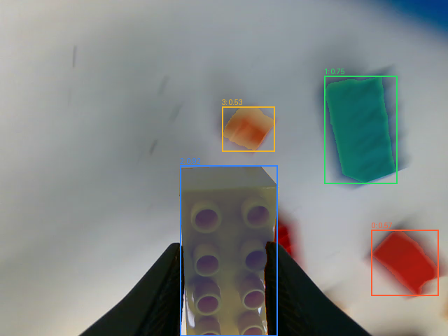
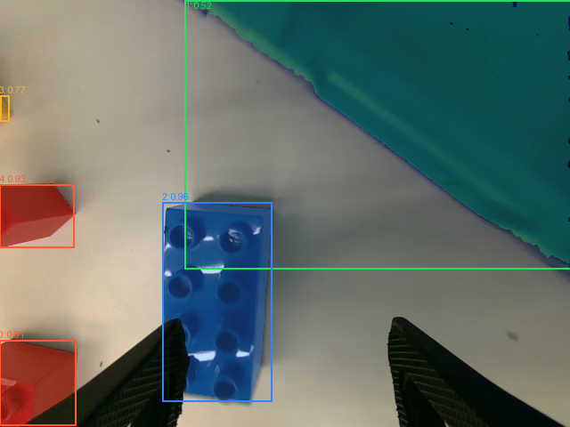

# PARTS 乐高抓取：Thor 环境与视觉验收（2026-10-10）

当前完成独立 SAM3 环境、单夹爪动作合同及可回放监督状态机。未实现 TD3+BC learner，未训练或启用 actor，未连接机器人。真实权重已本地下载、双端 SHA 校验并完成 Thor 前向；视觉与奖励仍需审核，随机模型或数张真实叠图都不能代替抓取成功判定。

## 方法与当前边界

用户要求按 [PARTS v2](https://arxiv.org/html/2609.21788v2) 的乐高抓取实验推进。[作者项目页](https://destiny000621.github.io/PARTS/) 本次仍标注 Code Coming Soon；本项目按公开论文独立实现，不能称官方代码或完整复现。

冻结 Pi0.5，左右夹爪分别学习局部开度残差，其他动作仍由 Pi 给出。论文候选为开度 ±0.50、最终 `[0,1]`；本包仅做数据层投影，尚未通过现场启用验收。RTC 已承诺前缀逐值保持，学习必须使用真实执行及投影后残差。算法目标是 chunk-level TD3+BC、成功残差 BC、可选失败零锚定、reference dropout 和成功重加权重训；旧整轮 CalQL/SAC 提案已被本次路线替代，旧包/数据保留。

用户确认 **相对进入抓取位置抬升 0.05 m**；结合新鲜腕部持物视觉连续 **1 s** 判定局部成功。整轮 C/N 只作评估。遮挡、陈旧图像、断流、证据不足保留 null/review。检测到积木、夹爪关闭、抬升各自都不足以单独证明抓取成功。

14 集 FK 实际扫描见 [source_pose_availability.json](source_pose_availability.json)：70,504 条单臂位姿记录有效，绝对高度/桌面标定/local attempt 都未提供。相对位移仍可研究，但必须核对 `left_base/right_base` 的向上轴和参考点；不擅自把 base-Z 当重力向上。每次成功需记录 entry、抬升差、持物区间、图像采样时间和来源。第一集保留验证，原始文件不改。

## 固定环境

| 项目 | 实际值 |
|---|---|
| Thor | aarch64、Jetson Linux R39.2.1、CUDA capability 11.0 |
| NVIDIA 基础镜像 | `nvcr.io/nvidia/pytorch@sha256:9024018b27e9ad043d1b88984b4fb7b705df9778f3688ca7cbaf399031421cde` |
| SAM3 官方源码 | `0570b3a5be9c4e694f23d85232fb55f4a6f1f7fc` |
| 当前镜像 | `parts-vision:thor-sam3-0570b3a-20261010-r3` |
| 当前镜像 ID | `sha256:2711020dd277e9114ef6296ddc0ed721de376a4b1156183ed39c6c1450a2439c` |
| Python / Torch | 3.12.3 / `2.12.0a0+5aff3928d8.nv26.05` |
| torchvision / CUDA build | `0.27.0a0+6214cb20.nv26.05` / 13.2 |
| Triton | `3.7.0+gitb4e20bb.nv26.5` |
| 私有 venv | `/opt/parts-vision`，继承 NVIDIA GPU 栈 |
| 额外锁定依赖 | NumPy1.26.4、timm1.0.27、ftfy6.1.1、iopath0.1.10、av15.1.0、h5py3.16.0、pytest8.4.2、setuptools80.9.0 |

SAM3 要求 NumPy<2，venv 覆盖不改基础镜像系统 NumPy。setuptools 固定为仍含 `pkg_resources` 的版本。Dockerfile/requirements/audit 归 `scripts/docker/thor/parts-vision*`、`scripts/thor/parts_vision_audit.py`，上游代码未复制进 Git。

R3 构建包 `/home/wuyan-lyj/condapi-data/rl/parts-vision-env-20261010/install-r3/context.tar` 大小 5,283,840 bytes，SHA256 `a5b45f558c1a31756fe11fc6f90564afe1c064dac4168d3aff58c54ab516e9d8`，Thor 端一致。完整 context 文件哈希和 pip freeze 保留在该外部产物目录；Thor 构建日志归 `/home/wuyan-lyj/thor/parts-vision/install/20261010-r3/`。R1/R2 原件保留。

## 实际检查与失败原因

- [依赖与 CUDA](environment-import-r1.json)：pip check=0、CUDA 矩阵乘法有限、torchvision GPU NMS 返回 `[0]`，SAM3 可导入。
- R1 全模型随机前向暴露 fused MLP 的 BF16 输入与 FP32 weight dtype 不匹配，未视为通过。按官方 image predictor notebook 采用 BF16 autocast 后，R2 [随机权重前向](random-kernel-r2.json) 通过；不修改上游模型代码、不转换权重存储。
- R2 参数 840,509,750、存储 FP32；峰值 allocated 4,068,212,736 bytes。加载约11.55s、首次前向约1.57s，仅为随机模型单次环境观察，不能当真实权重稳态延迟或与 Pi 并发预算。
- R3 audit 增加原始 logits/boxes/masks/presence 的非空与 finite 检查，避免阈值过滤后空结果使检查虚通过；支持输出分割叠图与原始 mask/box/score，不自动给抓取 reward。
- 本地纯数组/协议测试 24 项通过，ruff 通过；无本地 Torch 前向、训练循环或训练 smoke。

所有模型前向都在 Thor 临时 `--rm`、`--network none`、无端口、无控制设备映射的独立容器执行。没有停止/重启 Pi；操作前状态分别观察，早期看到 Pi 已退出137，后续看到 Pi 已重新运行，两者均非本任务变更。不动其他实验容器。

## 权重来源与转运

2026-10-10 17:48 CST，本地已登录账户访问官方权重得到 HTTP403：`awaiting a review from the repo authors`。申请已提交，问题是作者审核未完成。

用户随后提供 [1038lab/sam3](https://huggingface.co/1038lab/sam3/blob/main/sam3.pt)。公开下载 HEAD=200；查询两仓库 API，官方 revision `3c879f39826c281e95690f02c7821c4de09afae7`、镜像 revision `ea8e153c669a0284a496c0ec65a53b8e4f5ca7e7` 的 `sam3.pt` 均为 **3,450,062,241 bytes**、SHA256 **`9999e2341ceef5e136daa386eecb55cb414446a00ac2b55eb2dfd2f7c3cf8c9e`**。按镜像固定 revision 下载，保留 Meta 原许可证和来源记录；[本地实算 SHA](weight-download-verified.json) 与[Thor 接收端实算 SHA](weight-transfer-verified.json) 均一致，不只相信文件名或模型卡。无需向 Thor 传账户 token。

本地目录：`/home/wuyan-lyj/condapi-data/rl/parts-vision-env-20261010/models/1038lab-sam3-ea8e153c/`。下载中间件 `.partial` 与完成权重独立命名，坏校验不会晋级。Thor 权重在 `/home/wuyan-lyj/thor/parts-vision/models/1038lab-sam3-ea8e153c/sam3.pt`，原始参数保持 FP32。来源元数据见 [weight-source-metadata.json](weight-source-metadata.json)。

## 录像样本与标签就绪状态

[fixture_manifest.json](fixture_manifest.json) 保存原始 episode `d1afbec884974b49bc91a78bba802f8d` 的三视角视频第600帧、PTS/time_base 和 PNG SHA。这是模型前向 fixture，不是人工成功标注；视频第600帧不等于控制第600行，回放必须通过 `video_indices` 对齐。

正式权重五张样本均完成前向，原始 200 个候选的 logits/box/mask/presence 非空且有限，参数存储 FP32、权重 SHA 一致、pip check=0。以下检测数量不是抓取成功数量：

| 样本 | 检测数 | 首次前向（含原始张量检查） | 证据 |
|---|---:|---:|---|
| 右腕 video600，接近桌面蓝积木 | 5 | 1.470 s | [JSON](pretrained-right-frame600-r3.json) |
| 左腕 video600 | 5 | 1.525 s | [JSON](pretrained-left-frame600-r3.json) |
| 顶视 video600 | 10 | 1.473 s | [JSON](pretrained-top-frame600-r3.json) |
| 左腕 row960/video960，黄色积木位于夹爪内 | 4 | 1.515 s | [JSON](pretrained-left-row960-video960-r3.json) |
| 右腕 row560/video560，闭爪画面有运动模糊 | 0 | 1.491 s | [JSON](pretrained-right-row560-video560-r3.json) |

手动查看叠图：左腕夹爪内黄色积木检出 score0.921875；右腕桌面蓝积木 score0.96484375，同时蓝色容器边缘被误检为积木 score0.5234375。因此还需容器区域排除与夹爪空间/运动时序证据，不能直接拿全图 `any(mask)` 作 held。右腕模糊画面 0 检出保留未知，不据此标空手或失败。这里只有数张定性观察，没有 precision/recall、完整时序或 reward 准确率验收。

补充六帧的 row→video join、FK 及 openness 在 [additional-fixture-manifest.json](additional-fixture-manifest.json)。这些记录只用于视觉审核，所有 grasp reward 保留 null。原始 masks/boxes/scores NPZ 与完整叠图在 Thor `/home/wuyan-lyj/thor/parts-vision/reports/pretrained-*-r3/`，本地备份在外部产物 `real-predictions/`；没有回写 raw。

当前约1.5s是单次完整前向观察，未做 warm steady-state 或 Pi 并发延迟验收。先用于离线候选标注；实时路径还须验证图像缓存、视频跟踪或异步感知预算，不能阻塞现有控制循环，也不能把重复查询旧图当连续持物。

当前 `reward_generation_ready=false`。真实视觉评估需包含桌面、夹爪内持物、空手、容器内积木、遮挡及掉落；还需验证时序/运动学条件。输出候选数据供用户审核后才可进入学习，不能把 SAM3 可加载或几张叠图当成整套奖励已验证。客户端改造需求先展示用户审核，不自动发任务；当前无生产接入、无训练。

后续14集完整批次已完成3846张图的Thor推理及273个候选审核视频：建议成功2、失败0、不确定271，**自动奖励尚未通过**。初版仅腕部单条夹爪提示，用户反馈后新增外观词、裁剪/顶视、SAM3框/点提示小批比较；环境完成不代表检测语义或奖励完成。当前数据、媒体、运行摘要和限制归[逐抓取报告](../../rl/parts-grasp-review14-20261010/README.md)，不以本页早期5帧定性观察代替后续批次结果。
