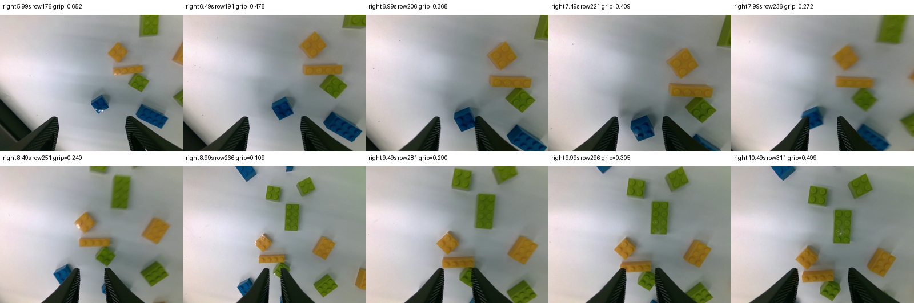
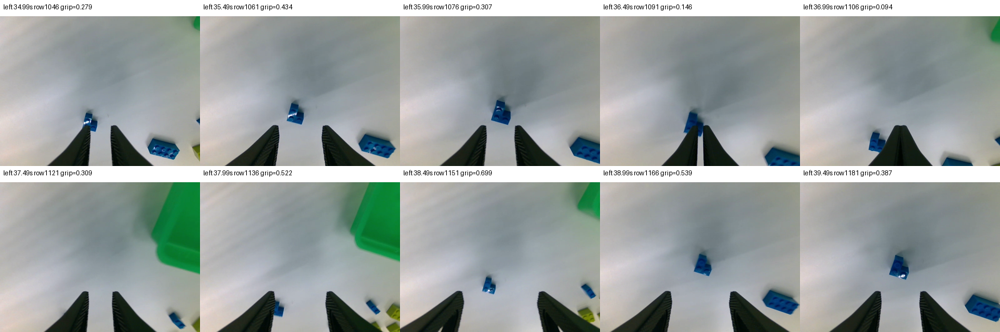
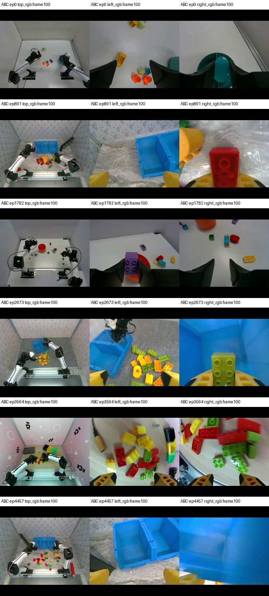
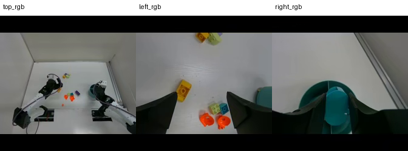

# 2026-09-16 · 训练重设计证据

本目录保存只读现场核查与离线数组分析。方案唯一owner为 [03训练与评估](../../../03_training_and_evaluation.md#2026-09-16--训练重设计先复现乐高分拣再比较模型)，Evo接入归 [10](../../../10_vla_platform.md#2026-09-16--evo-1对照实验的范围)。没有启动训练、调用GPU模型、改服务、写机器人或修改YAM项目。

## 乐高分拣3最新异步测试

**最新为14:51会话，以下14:14结论保留作历史对照。** 用户进一步报告夹爪改善、仍抓不到积木，并确认现场普通2×2小颗粒底面约16 mm。本次只读状态接口定位 `session_20260916_145144_878545/episode_000001`；获取已保存的HDF5、manifest和三路视频，不操作机器人或控制代码。

- [manifest投影](lego3-145144-manifest.json)、[数值汇总](lego3-145144-summary.json)、[原始HDF5 gzip](lego3-145144-samples.h5.gz)：1370帧/45.755秒、1364行有效policy、130个有效回复，仍为streaming/RTC关闭，录制以 `episode queue full` / aborted结束。热态服务p95 110.29ms，worker127.51ms，观测到回复166.26ms。
- HDF5源端/本地SHA256均为 `0e67cbd67efe01602450f65c860745bca4947e7d83f45fc225d13ae80e0d6219`。三路视频各解码1370帧、640×480，HDF5 video_indices逐行等于行号；三个MP4的源端/本地哈希也一致，保存在summary。完整MP4保留源端及本地临时分析目录，不入Git。

| 有效行全段最低值；0闭/1开 | 左夹爪 | 右夹爪 |
|---|---:|---:|
| policy_action | 0.0439 | 0.0356 |
| submitted_action | 0.0485 | 0.0402 |
| measured_state | 0.0818 | 0.0387 |

各列极小值不同帧。左/右反馈<0.3分别379/264行，部分连续超过2秒；提交与反馈夹爪绝对差p95均约0.027。这支持“夹爪已能持续大幅闭合”，不支持继续沿用14:14的“一直闭合不了”描述；它不是标定、接触力或抓取成功验收。关节目标/提交仍有差异，不能因为夹爪能闭就宣称异步轨迹的空间和时序均已正确。

**视觉核查与尺度限制：** 右臂约6–10.5秒、左臂约35–39.5秒的相邻视频帧显示多次接近/闭合/再次张开；可见目标位于指尖前方或靠一侧指尖，之后仍可见于桌面，抽查片段未见稳定夹持并抬升。二维腕部图有遮挡和透视，不能仅由投影判断下降高度、接触力、毫米级横向误差或根因。

[224几何预览](lego3-145144-224-preview.png)将完整640×480 RGB等比缩到224×168并补黑。它用PIL bilinear，仅用于几何示意，不冒充服务端实际预处理张量。手工框选两个可见积木示例：顶视起始帧约14×10原像素→4.9×3.5模型尺度像素；左腕39.99秒约62×83→21.7×29.1像素。两者并非已追踪同一物体，框是近似人工标注，不能外推成全场分布、最小可抓尺寸或物理尺寸；原坐标与说明见 [pixel notes](lego3-145144-pixel-notes.json)。顶视细节少，但近腕并非完全不可辨，不能据此断言单一分辨率根因。

**ABC进一步抽查：** 在已发布train的转换后episode索引0/891/1782/2673/3564/4457各取frame100、三路共18帧。图中可见不同背景、容器、黑/黄色指形，以及较大/较厚的积木形态；与现场16 mm小颗粒并不能视为已验证的相同物体分布。未获得源积木实测尺寸，不能把外观判断写成“全部ABC都是32 mm得宝”，也不能用6集估计全量比例。精确视频路径、时间戳、PNG哈希与抽样方法见 [provenance](training-six-frame-provenance.json)。此抽查只解码已有视频，不运行GPU或训练。

下一步是冻结当前执行版本做大小/人工基线诊断，再按现场目标状态补少量高质量示范；详细预算及停止条件唯一归 [03现场补采计划](../../../03_training_and_evaluation.md#现场16-mm小颗粒的补采与适配计划)。

用户随后明确请求深入分析YAM底层优化，本次追加只读源码审查和纯数组重放；完整解释归 [03控制审查](../../../03_training_and_evaluation.md#yam控制优化对成功率的影响用户追加的只读审查)，[JSON回执](lego3-145144-control-audit.json)绑定源文件哈希。将每行未丢弃的policy_reply按其received_at/origin投入受审ActionBuffer，夹爪按原实现先限到[0,1]，在HDF5 time上调用current；1364有效行全部14维与policy_action逐值相同。利用buffer实际候选回溯夹爪来源：观测年龄中位1.024秒，比最新块多旧约0.700秒，目标时刻保持一致。隔离TrajectoryFilter并以100Hz输入0.1 rad关节阶跃，90%响应为0.40秒；没构造执行线程/硬件，也不是闭环物理模拟或成功率预测。这里用到本地YAM纯数组模块，不修改外部仓库。

15:25 +08最后一次只读状态复核仍指向本1370帧记录、inference/HOLD、recording=false、queue full；本地YAM HEAD仍13e5afd747dd1c0a43e25fa4680f186ffbbd77a2。15:08以后的录制改动晚于此次试验，不能将新源码状态视作该次录制/部署已通过。

## 14:14会话：历史异步夹爪问题

用户指定“乐高分拣3”；只读 `http://192.168.110.140:8766/status` 定位记录，状态为inference/HOLD、未录制。记录会话 `session_20260916_141405_f47544`，任务ID `5dbcd16f-6d45-4e60-9791-10cdbe6f1191`，episode1。只从IPC读这条已有记录及manifest，未读取或修改其控制/采集实现。

- [manifest](lego3-manifest.json)：1325帧、30Hz、三路640×480、streaming=true、RTC=false、ensemble=3；任务文本与训练一致。episode因 `episode queue full` 中止，不能当完整成功率评估。
- [原始HDF5的gzip归档](lego3-samples.h5.gz)：解压后SHA256 `7ef27ef77e4410ef922e4c3163ee8f18c259c4c0ff0bcbe8e7dfe1eebfe188ee`，与IPC源文件sha256sum核对一致，gzip仅压缩不改数组。
- [汇总](lego3-summary.json)、[每请求闭合/执行索引表](lego3-closure-schedule.json)：1325行中1318行policy有效，44.257秒，126个有效回复。热态p95为服务110.24ms、worker请求128.80ms、observation→收到164.59ms（均排除第一个回复）。

| 0闭/1开；有效行全段最低值 | 左夹爪 | 右夹爪 |
|---|---:|---:|
| 选中的policy_action | 0.4725 | 0.5066 |
| 记录中的submitted_action | 0.8128 | 0.6712 |
| measured_state | 0.8168 | 0.6765 |

各行最低值不一定发生在同一帧。两个同帧例子：5.033秒左侧0.4725→0.8280→0.8462；38.791秒右侧0.5066→0.7369→0.7556，顺序为策略→提交→反馈。

右夹爪17个H50块包含<0.3的预测，但选中近期动作全程没有<0.3；第100请求预测第35步首次<0.3，实际消费第4–14步。左夹爪没有任何完整块预测<0.3。选中夹爪与原始块对应索引最大差左0、右0.000142（包含边界裁剪差异），未见三块平均把该路闭合摊平的证据。选中目标短脉冲与提交/反馈存在额外偏离，具体限制来源需控制侧核对。

阈值0.3/0.5/0.7仅用于分析，不是物理接触/闭合标注。记录中没有持续近零提交，所以不能由本试验验证完整夹爪行程，亦不能排除比例/标定问题。30Hz记录不还原每个可能的100Hz电机写入；当前状态显示trajectory_hz=100且HOLD时inactive，不据此声称整段高频执行已独立验证。没有读取视频或专家目标，也没有重跑模型，不能独立确认何时已抓到物体。

## 旧90帧记录（单独保留，不代替最新试验）

读取YAM项目时本地已有 `/tmp/yam_inference_90_samples.h5`，文件时间11:44；原件归档为 [trace90-samples.h5](trace90-samples.h5)。SHA256 `b302836ea15373f3d48dfd61a12cf8162afec76be306f8dc6374fcc2ac0eac14`。这是旧3秒版本，不是后来的188/190/203帧或乐高分拣3。

[汇总](trace90-summary.json)、[逐请求表](trace90-closure-schedule.json)：90行、82有效policy行、13回复、2.963秒，热态observation→收到p95 167.36ms。右夹爪完整块最低0.1808，选中策略最低0.7690、提交0.8539、反馈0.8590。没有图像像素、checkpoint权重指纹、噪声或专家标签，不能作为完整任务成绩。

同目标时刻块间差方法：用每个请求observed_at+i/30定位原始动作，旧块关节线性插值到新块时间，不外推；在重叠区间取12关节最大绝对差，汇总512个点。该指标包含未执行远段，不能与YAM报告的近端/接缝指标直接比较。

## 服务器与训练帧

[服务器快照](server-snapshot.json)保存观察时间、train/val metadata、源revision、暂停/目标变更/恢复配置、末条日志和squeue。训练按用户要求暂停于100531日志步，最新完整点100000；没有恢复任务。帧数、时间和batch换算见03，快照不证明未来服务器状态。

只解码source episode95（转换后episode0）frame100的三路图像，来自固定revision `68651e4929d9fb00f798937b2d62617cab5c771d` 的已发布train视频 `videos/observation.images.{view}/chunk-000/file-000.mp4`。[统计](training-frame-stats.json)与下图显示224×224带上下近黑补边，兼容4:3等比缩放；没有据单集确认全量视频、现场相机视角或曝光完全一致。

## 重算口径与限制

分析环境只导入h5py/numpy/标准库，不初始化Torch/JAX/CUDA。有效行定义为 `policy_action__valid & details.policy_valid`；夹爪维度6/13。每条 `details.policy_reply` 仅保留未discard且无error者，`token.request_id`关联每行request，`action_index`定位50步原始块。夹爪范围/差值仅统计有效policy行，不能把初始化占位0当闭合。

原始数据与summary均保留；本轮用户同款kit/三D405的描述属于现场确认。引用的YAM历史说明来自当时提交 `3a3378d122222e0ea0374b097f228adcb2e84dfb`；之后观察到 `a678f3a`，并按用户指定读取最新原始记录。源码版本变化、记录缺少模型身份及高频子步是归因限制，不能以旧说明替代新结果。
